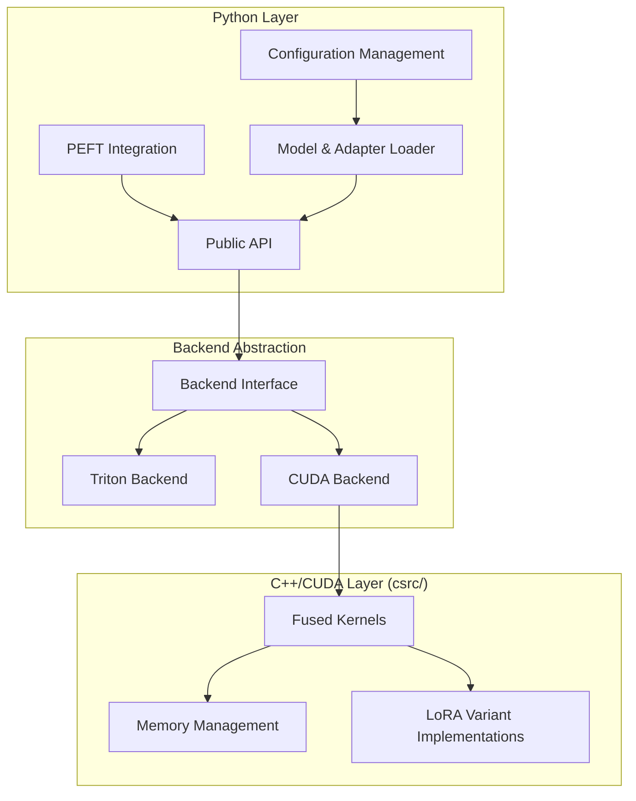
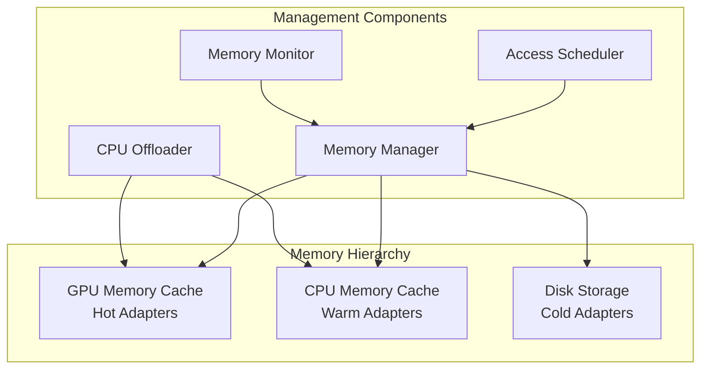

# Design Document

## Overview

The fd-lora library implements a high-performance, inference-only LoRA system with support for multiple LoRA variants. The design emphasizes dynamic adapter application without weight fusion, leveraging optimized CUDA kernels for maximum throughput. The architecture separates Python interface code from C++/CUDA compute kernels, providing clean abstractions while maintaining compatibility with the Hugging Face ecosystem.

The library supports standard LoRA, DoRA (Weight-Decomposed Low-Rank Adaptation), and other advanced variants through a unified interface that automatically detects and applies the appropriate computation method for each adapter type.

## Architecture

### High-Level Architecture



### Directory Structure

```
fd-lora/
├── fd_lora/                    # Python package
│   ├── __init__.py
│   ├── api.py                  # Public API
│   ├── config.py               # Configuration management
│   ├── backends/               # Backend implementations
│   │   ├── __init__.py
│   │   ├── base.py            # Abstract backend interface
│   │   ├── triton_backend.py  # Triton implementation
│   │   └── cuda_backend.py    # CUDA backend wrapper
│   ├── peft_integration/       # PEFT compatibility layer
│   │   ├── __init__.py
│   │   └── adapters.py
│   └── utils/
│       ├── __init__.py
│       └── model_utils.py
├── csrc/                       # C++/CUDA source code
│   ├── CMakeLists.txt          # Root CMake for IDE support
│   ├── include/
│   │   ├── fd_lora/
│   │   │   ├── kernels.h
│   │   │   ├── memory.h
│   │   │   ├── variants.h
│   │   │   ├── memory_manager.h
│   │   │   └── cutlass_integration.h
│   ├── src/
│   │   ├── CMakeLists.txt      # Source CMake configuration
│   │   ├── core/               # CUDA primitives and low-level operations
│   │   │   ├── CMakeLists.txt
│   │   │   ├── cuda_utils.cu
│   │   │   ├── matrix_ops.cu
│   │   │   └── memory_primitives.cu
│   │   ├── kernels/
│   │   │   ├── CMakeLists.txt
│   │   │   ├── lora_kernel.cu
│   │   │   ├── dora_kernel.cu
│   │   │   ├── fused_ops.cu
│   │   │   └── cutlass_kernels.cu  # Future Cutlass integration
│   │   ├── memory/
│   │   │   ├── CMakeLists.txt
│   │   │   ├── memory_pool.cpp
│   │   │   ├── memory_manager.cpp
│   │   │   └── cpu_offloader.cpp
│   │   └── variants/
│   │       ├── CMakeLists.txt
│   │       ├── standard_lora.cpp
│   │       ├── dora.cpp
│   │       └── variant_registry.cpp
│   └── python_bindings/
│       ├── CMakeLists.txt      # PyBind11 bindings CMake
│       └── bindings.cpp        # PyBind11 bindings
├── tests/
├── benchmarks/
└── setup.py
```

## Components and Interfaces

### Memory Management System

The intelligent memory management system handles thousands of LoRA adapters through CPU offloading, caching, and automatic cleanup:

```python
class MemoryManager:
    def __init__(self, gpu_memory_limit: int, cpu_memory_limit: int):
        self.gpu_memory_limit = gpu_memory_limit
        self.cpu_memory_limit = cpu_memory_limit
        self.gpu_cache = LRUCache(capacity=self._calculate_gpu_capacity())
        self.cpu_cache = LRUCache(capacity=self._calculate_cpu_capacity())
        self.offloader = CPUOffloader()
    
    def get_adapter(self, adapter_id: str) -> LoadedAdapter:
        """Get adapter, loading from CPU/disk if necessary."""
        pass
    
    def preload_adapters(self, adapter_ids: List[str]) -> None:
        """Preload frequently used adapters to GPU."""
        pass
    
    def offload_to_cpu(self, adapter_ids: List[str]) -> None:
        """Move adapters from GPU to CPU memory."""
        pass
    
    def cleanup_unused(self, threshold_minutes: int = 30) -> None:
        """Remove unused adapters from memory."""
        pass

class CPUOffloader:
    def offload_adapter(self, adapter: LoadedAdapter) -> OffloadedAdapter:
        """Move adapter from GPU to CPU memory."""
        pass
    
    def restore_adapter(self, offloaded: OffloadedAdapter) -> LoadedAdapter:
        """Move adapter from CPU back to GPU memory."""
        pass
    
    def get_memory_usage(self) -> Dict[str, int]:
        """Get current CPU/GPU memory usage statistics."""
        pass
```

### Backend Interface

The backend system provides a unified interface for different compute implementations with future Cutlass support:

```python
class BackendInterface(ABC):
    @abstractmethod
    def apply_lora(self, base_weight: torch.Tensor, 
                   lora_a: torch.Tensor, lora_b: torch.Tensor,
                   variant_type: LoRAVariant, **kwargs) -> torch.Tensor:
        """Apply LoRA adaptation to base weights."""
        pass
    
    @abstractmethod
    def batch_apply_lora(self, base_weights: List[torch.Tensor],
                        adapters: List[LoRAAdapter]) -> List[torch.Tensor]:
        """Apply multiple LoRA adapters in batch."""
        pass
    
    @abstractmethod
    def is_available(self) -> bool:
        """Check if backend is available on current system."""
        pass
    
    @abstractmethod
    def get_memory_requirements(self, adapter: LoadedAdapter) -> int:
        """Calculate memory requirements for adapter."""
        pass

class CutlassBackend(BackendInterface):
    """Future Cutlass backend implementation for optimized GEMM operations."""
    
    def __init__(self):
        self.cutlass_available = self._check_cutlass_availability()
    
    def _check_cutlass_availability(self) -> bool:
        """Check if Cutlass is available and properly configured."""
        pass
    
    def apply_lora(self, base_weight: torch.Tensor, 
                   lora_a: torch.Tensor, lora_b: torch.Tensor,
                   variant_type: LoRAVariant, **kwargs) -> torch.Tensor:
        """Use Cutlass optimized GEMM for LoRA computation."""
        pass
```

### LoRA Variant System

The variant system handles different LoRA types through a registry pattern:

```python
class LoRAVariant(Enum):
    STANDARD = "standard"
    DORA = "dora"
    ADALORA = "adalora"

class VariantHandler(ABC):
    @abstractmethod
    def compute_adaptation(self, base_weight: torch.Tensor,
                          adapter_params: Dict[str, torch.Tensor]) -> torch.Tensor:
        pass
    
    @abstractmethod
    def validate_params(self, params: Dict[str, torch.Tensor]) -> bool:
        pass

class VariantRegistry:
    def register_variant(self, variant_type: LoRAVariant, 
                        handler: VariantHandler) -> None:
        """Register a new LoRA variant handler."""
        pass
    
    def get_handler(self, variant_type: LoRAVariant) -> VariantHandler:
        """Get handler for specific variant type."""
        pass
```

### PEFT Integration Layer

Maintains compatibility with existing PEFT workflows:

```python
class FDLoRAPEFTAdapter(PeftModel):
    def __init__(self, model, peft_config, adapter_name="default"):
        super().__init__(model, peft_config, adapter_name)
        self.fd_lora_backend = self._initialize_backend()
    
    def forward(self, *args, **kwargs):
        # Intercept forward pass and apply fd-lora optimizations
        return self._optimized_forward(*args, **kwargs)
    
    def _optimized_forward(self, *args, **kwargs):
        # Use fd-lora backend for LoRA computations
        pass
```

## Data Models

### Adapter Configuration

```python
@dataclass
class LoRAAdapterConfig:
    variant_type: LoRAVariant
    rank: int
    alpha: float
    target_modules: List[str]
    dropout: float = 0.0
    bias: str = "none"
    
    # Variant-specific parameters
    variant_params: Dict[str, Any] = field(default_factory=dict)

@dataclass
class DoRAConfig(LoRAAdapterConfig):
    magnitude_vector: bool = True
    direction_decomposition: bool = True
    
    def __post_init__(self):
        self.variant_type = LoRAVariant.DORA
        self.variant_params.update({
            "magnitude_vector": self.magnitude_vector,
            "direction_decomposition": self.direction_decomposition
        })
```

### Runtime Adapter State

```python
@dataclass
class LoadedAdapter:
    name: str
    config: LoRAAdapterConfig
    weights: Dict[str, torch.Tensor]
    variant_handler: VariantHandler
    device: torch.device
    dtype: torch.dtype
    last_accessed: datetime
    memory_usage: int
    
    def to_device(self, device: torch.device) -> 'LoadedAdapter':
        """Move adapter to specified device."""
        pass
    
    def get_memory_footprint(self) -> int:
        """Calculate total memory usage of adapter."""
        pass

@dataclass
class OffloadedAdapter:
    name: str
    config: LoRAAdapterConfig
    cpu_weights: Dict[str, torch.Tensor]
    variant_handler: VariantHandler
    original_device: torch.device
    original_dtype: torch.dtype
    offload_timestamp: datetime
    
    def restore_to_gpu(self) -> LoadedAdapter:
        """Restore adapter to GPU memory."""
        pass

@dataclass
class AdapterMetadata:
    name: str
    size_bytes: int
    last_accessed: datetime
    access_frequency: int
    priority_score: float
    location: str  # "gpu", "cpu", "disk"
```

### Backend Configuration

```python
@dataclass
class BackendConfig:
    preferred_backend: str = "cuda"
    fallback_backends: List[str] = field(default_factory=lambda: ["triton", "cutlass"])
    memory_pool_size: int = 1024 * 1024 * 1024  # 1GB
    enable_kernel_fusion: bool = True
    max_batch_size: int = 32
    enable_cutlass: bool = False  # Future feature flag

@dataclass
class MemoryConfig:
    gpu_memory_limit: int = 8 * 1024 * 1024 * 1024  # 8GB
    cpu_memory_limit: int = 32 * 1024 * 1024 * 1024  # 32GB
    offload_threshold: float = 0.8  # Offload when 80% GPU memory used
    cleanup_interval: int = 300  # Cleanup every 5 minutes
    preload_popular_adapters: bool = True
    max_adapters_in_gpu: int = 100
    max_adapters_in_cpu: int = 1000
```

## Memory Management Architecture

### Intelligent LoRA Management

The memory management system handles thousands of LoRA adapters through a multi-tier caching strategy:



### Memory Management Strategies

1. **LRU-based Eviction**: Least recently used adapters are moved from GPU to CPU
2. **Predictive Preloading**: Frequently accessed adapters are preloaded to GPU
3. **Memory Pressure Response**: Automatic cleanup when memory usage exceeds thresholds
4. **Batch Operations**: Efficient batch loading/offloading to minimize overhead

### CPU Offloading Implementation

```python
class IntelligentMemoryManager:
    def __init__(self, config: MemoryConfig):
        self.config = config
        self.gpu_cache = AdapterCache("gpu", config.max_adapters_in_gpu)
        self.cpu_cache = AdapterCache("cpu", config.max_adapters_in_cpu)
        self.access_tracker = AccessTracker()
        self.memory_monitor = MemoryMonitor()
        
    def get_adapter(self, adapter_id: str) -> LoadedAdapter:
        """Smart adapter retrieval with automatic loading."""
        # Check GPU cache first
        if adapter_id in self.gpu_cache:
            return self.gpu_cache.get(adapter_id)
        
        # Check CPU cache
        if adapter_id in self.cpu_cache:
            return self._promote_to_gpu(adapter_id)
        
        # Load from disk
        return self._load_from_disk(adapter_id)
    
    def _promote_to_gpu(self, adapter_id: str) -> LoadedAdapter:
        """Move adapter from CPU to GPU with memory management."""
        # Check if GPU has space
        if self._gpu_memory_available() < self._get_adapter_size(adapter_id):
            self._make_gpu_space(self._get_adapter_size(adapter_id))
        
        # Move adapter to GPU
        offloaded_adapter = self.cpu_cache.get(adapter_id)
        gpu_adapter = offloaded_adapter.restore_to_gpu()
        self.gpu_cache.put(adapter_id, gpu_adapter)
        self.cpu_cache.remove(adapter_id)
        
        return gpu_adapter
    
    def _make_gpu_space(self, required_bytes: int) -> None:
        """Free GPU memory by offloading least used adapters."""
        candidates = self.gpu_cache.get_lru_candidates()
        freed_bytes = 0
        
        for adapter_id in candidates:
            if freed_bytes >= required_bytes:
                break
            
            adapter = self.gpu_cache.get(adapter_id)
            offloaded = self._offload_to_cpu(adapter)
            self.cpu_cache.put(adapter_id, offloaded)
            self.gpu_cache.remove(adapter_id)
            freed_bytes += adapter.memory_usage
    
    def background_cleanup(self) -> None:
        """Background process for memory optimization."""
        while True:
            time.sleep(self.config.cleanup_interval)
            
            # Remove unused adapters
            self._cleanup_unused_adapters()
            
            # Optimize cache distribution
            self._rebalance_caches()
            
            # Update access patterns
            self._update_access_patterns()

class AccessTracker:
    def __init__(self):
        self.access_history = defaultdict(list)
        self.frequency_scores = defaultdict(float)
    
    def record_access(self, adapter_id: str) -> None:
        """Record adapter access for pattern analysis."""
        now = datetime.now()
        self.access_history[adapter_id].append(now)
        self._update_frequency_score(adapter_id)
    
    def get_priority_score(self, adapter_id: str) -> float:
        """Calculate priority score for memory management decisions."""
        frequency = self.frequency_scores[adapter_id]
        recency = self._calculate_recency_score(adapter_id)
        return frequency * 0.7 + recency * 0.3
```

## Error Handling

### Exception Hierarchy

```python
class FDLoRAError(Exception):
    """Base exception for fd-lora library."""
    pass

class BackendError(FDLoRAError):
    """Backend-related errors."""
    pass

class VariantError(FDLoRAError):
    """LoRA variant-related errors."""
    pass

class ConfigurationError(FDLoRAError):
    """Configuration and setup errors."""
    pass

class CompatibilityError(FDLoRAError):
    """PEFT compatibility errors."""
    pass

class MemoryError(FDLoRAError):
    """Memory management errors."""
    pass

class OffloadError(FDLoRAError):
    """CPU offloading errors."""
    pass
```

### Error Recovery Strategies

1. **Backend Fallback**: Automatically fall back to available backends when preferred backend fails
2. **Graceful Degradation**: Fall back to standard PyTorch operations if all optimized backends fail
3. **Configuration Validation**: Validate configurations early with clear error messages
4. **Memory Recovery**: Implement memory pool cleanup on CUDA out-of-memory errors
5. **Offload Recovery**: Automatic CPU offloading when GPU memory is exhausted
6. **Cache Consistency**: Ensure adapter consistency across GPU/CPU/disk tiers

## Testing Strategy

### Unit Testing

1. **Variant Testing**: Test each LoRA variant implementation for numerical correctness
2. **Backend Testing**: Validate each backend against reference PyTorch implementations
3. **Configuration Testing**: Test configuration validation and error handling
4. **Memory Testing**: Test memory management and cleanup
5. **Offloading Testing**: Test CPU offloading and restoration mechanisms
6. **Cache Testing**: Test multi-tier caching behavior and consistency

### Integration Testing

1. **PEFT Compatibility**: Test integration with various PEFT model configurations
2. **Model Architecture Testing**: Validate with different Transformer architectures
3. **Multi-GPU Testing**: Test distributed inference scenarios
4. **Performance Regression**: Automated benchmarks to catch performance regressions
5. **Memory Stress Testing**: Test system behavior with thousands of LoRA adapters
6. **Offloading Performance**: Benchmark CPU offloading overhead and latency

### Numerical Accuracy Testing

```python
class NumericalAccuracyTest:
    def test_variant_accuracy(self, variant_type: LoRAVariant):
        """Compare fd-lora output with reference PyTorch implementation."""
        # Generate test data
        base_weight = torch.randn(1024, 1024, device="cuda")
        lora_a = torch.randn(1024, 16, device="cuda")
        lora_b = torch.randn(16, 1024, device="cuda")
        
        # Reference computation
        reference_output = base_weight + (lora_b @ lora_a)
        
        # fd-lora computation
        fd_lora_output = self.backend.apply_lora(
            base_weight, lora_a, lora_b, variant_type
        )
        
        # Assert numerical accuracy
        torch.testing.assert_close(reference_output, fd_lora_output, 
                                 rtol=1e-5, atol=1e-6)
```

### Performance Benchmarking

```python
class PerformanceBenchmark:
    def benchmark_throughput(self, model_size: str, batch_size: int):
        """Measure inference throughput compared to baseline PEFT."""
        # Setup models
        baseline_model = self._setup_peft_model(model_size)
        fd_lora_model = self._setup_fd_lora_model(model_size)
        
        # Benchmark inference
        baseline_time = self._measure_inference_time(baseline_model, batch_size)
        fd_lora_time = self._measure_inference_time(fd_lora_model, batch_size)
        
        speedup = baseline_time / fd_lora_time
        return {
            "baseline_time": baseline_time,
            "fd_lora_time": fd_lora_time,
            "speedup": speedup
        }
    
    def benchmark_memory_management(self, num_adapters: int):
        """Benchmark memory management with large numbers of adapters."""
        memory_manager = IntelligentMemoryManager(MemoryConfig())
        
        # Load many adapters
        start_time = time.time()
        for i in range(num_adapters):
            adapter_id = f"adapter_{i}"
            adapter = memory_manager.get_adapter(adapter_id)
        
        load_time = time.time() - start_time
        
        # Measure memory usage
        gpu_usage = memory_manager.memory_monitor.get_gpu_usage()
        cpu_usage = memory_manager.memory_monitor.get_cpu_usage()
        
        return {
            "load_time": load_time,
            "gpu_memory_usage": gpu_usage,
            "cpu_memory_usage": cpu_usage,
            "adapters_in_gpu": len(memory_manager.gpu_cache),
            "adapters_in_cpu": len(memory_manager.cpu_cache)
        }
```

### C++/CUDA Testing

1. **Kernel Unit Tests**: Test individual CUDA kernels with known inputs/outputs
2. **Memory Safety Tests**: Use tools like CUDA-MEMCHECK to validate memory operations
3. **Cross-Platform Testing**: Test compilation and execution across different CUDA versions
4. **Binding Tests**: Validate Python-C++ interface correctness

## CMake Configuration for IDE Support

The CMake files are included to provide better IDE support and easier C++ development, even though the actual build process uses setuptools/PyBind11:

### Root CMakeLists.txt Structure

```cmake
# csrc/CMakeLists.txt
cmake_minimum_required(VERSION 3.18)
project(fd_lora LANGUAGES CXX CUDA)

# Set C++ standard
set(CMAKE_CXX_STANDARD 17)
set(CMAKE_CUDA_STANDARD 17)

# Find required packages
find_package(CUDA REQUIRED)
find_package(Python COMPONENTS Interpreter Development REQUIRED)

# Include directories
include_directories(include)
include_directories(${CUDA_INCLUDE_DIRS})

# Add subdirectories for better organization
add_subdirectory(src/core)
add_subdirectory(src/kernels)
add_subdirectory(src/memory)
add_subdirectory(src/variants)
add_subdirectory(python_bindings)

# Optional: Create a library target for IDE navigation
add_library(fd_lora_core INTERFACE)
target_include_directories(fd_lora_core INTERFACE include)
```

### Component-Level CMake Files

Each subdirectory contains a CMakeLists.txt that defines its sources and dependencies:

```cmake
# csrc/src/core/CMakeLists.txt
set(CORE_SOURCES
    cuda_utils.cu
    matrix_ops.cu
    memory_primitives.cu
)

# Create interface library for IDE support
add_library(fd_lora_core_impl INTERFACE)
target_sources(fd_lora_core_impl INTERFACE ${CORE_SOURCES})
target_include_directories(fd_lora_core_impl INTERFACE ../../include)
```

### Benefits of CMake Structure

1. **IDE Integration**: Better IntelliSense, code navigation, and syntax highlighting
2. **Dependency Management**: Clear definition of include paths and dependencies
3. **Cross-Platform Development**: Easier development on different platforms
4. **Code Organization**: Logical grouping of related source files
5. **Future Extensibility**: Easy to add new components or external dependencies

**Note**: The CMake files are purely for development convenience and IDE support. The actual build process will use setuptools with PyBind11 for Python package creation.

The design provides a robust foundation for high-performance LoRA inference with support for multiple variants, intelligent memory management, clean separation of concerns, and comprehensive testing strategies.