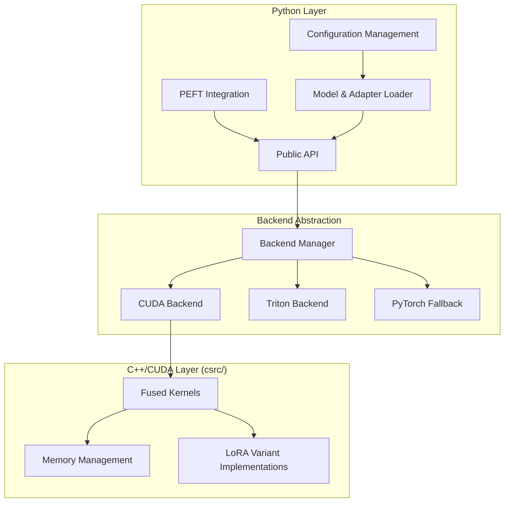

# Design Document

## Table of Contents

1. [Overview](#overview)
2. [Architecture](#architecture)
   - 2.1 [High-Level Architecture](#high-level-architecture)
   - 2.2 [Directory Structure](#directory-structure)
3. [Components and Interfaces](#components-and-interfaces)
   - 3.1 [Memory Management System](#memory-management-system)
   - 3.2 [Backend Interface](#backend-interface)
   - 3.3 [LoRA Variant System](#lora-variant-system)
   - 3.4 [Framework-Agnostic Backend Layer](#framework-agnostic-backend-layer)
   - 3.5 [PEFT Integration Layer](#peft-integration-layer)
4. [Data Models](#data-models)
   - 4.1 [Adapter Configuration](#adapter-configuration)
   - 4.2 [Runtime Adapter State](#runtime-adapter-state)
   - 4.3 [Backend Configuration](#backend-configuration)
5. [Memory Management Architecture](#memory-management-architecture)
   - 5.1 [Extensible Cache System](#extensible-cache-system)
   - 5.2 [Cache Strategy Architecture](#cache-strategy-architecture)
   - 5.3 [Cache Strategy Implementations](#cache-strategy-implementations)
   - 5.4 [Cache Strategy Selection Guidelines](#cache-strategy-selection-guidelines)
   - 5.5 [Intelligent LoRA Management](#intelligent-LoRA-management)
   - 5.6 [Memory Management Strategies](#memory-management-strategies)
   - 5.7 [CPU Offloading Implementation](#cpu-offloading-implementation)
6. [Error Handling](#error-handling)
   - 6.1 [Exception Hierarchy](#exception-hierarchy)
   - 6.2 [Error Recovery Strategies](#error-recovery-strategies)
7. [Testing Strategy](#testing-strategy)
   - 7.1 [Unit Testing](#unit-testing)
   - 7.2 [Integration Testing](#integration-testing)
   - 7.3 [Numerical Accuracy Testing](#numerical-accuracy-testing)
   - 7.4 [Performance Benchmarking](#performance-benchmarking)
   - 7.5 [C++/CUDA Testing](#ccuda-testing)
8. [CMake Configuration for IDE Support](#cmake-configuration-for-ide-support)
   - 8.1 [Root CMakeLists.txt Structure](#root-cmakeliststxt-structure)
   - 8.2 [Component-Level CMake Files](#component-level-cmake-files)
   - 8.3 [Benefits of CMake Structure](#benefits-of-cmake-structure)
9. [Framework-Specific Usage Examples](#framework-specific-usage-examples)
   - 9.1 [PEFT Integration](#peft-integration)
   - 9.2 [Universal Integration Manager](#universal-integration-manager)
   - 9.3 [Cache Strategy Configuration](#cache-strategy-configuration)
10. [Future Additions](#future-additions)
    - 10.1 [SGLang Framework Integration](#sglang-framework-integration)
    - 10.2 [vLLM Framework Integration](#vllm-framework-integration)
    - 10.3 [Tensor Parallelism Support](#tensor-parallelism-support)
    - 10.4 [Additional LoRA Variants](#additional-lora-variants)
    - 10.5 [Enhanced Backends](#enhanced-backends)
    - 10.6 [Advanced Memory Management](#advanced-memory-management)

## Overview

The fd-lora library implements a high-performance, inference-only LoRA system with support for multiple LoRA variants. The design emphasizes dynamic adapter application without weight fusion, leveraging optimized CUDA kernels for maximum throughput. The architecture separates Python interface code from C++/CUDA compute kernels, providing clean abstractions while maintaining compatibility with the Hugging Face ecosystem.

The library supports standard LoRA, DoRA (Weight-Decomposed Low-Rank Adaptation), and other advanced variants through a unified interface that automatically detects and applies the appropriate computation method for each adapter type.

## Architecture

### High-Level Architecture



### Directory Structure

```
fd-lora/
├── fd_lora/                    # Python package
│   ├── __init__.py
│   ├── api.py                  # Public API
│   ├── config.py               # Configuration management
│   ├── backends/               # Backend implementations
│   │   ├── __init__.py
│   │   ├── base.py            # Abstract backend interface
│   │   ├── cuda_backend.py    # CUDA backend with SGMV
│   │   └── triton_backend.py  # Triton backend with SGMV
│   ├── kernels/               # Triton kernel implementations
│   │   ├── __init__.py
│   │   ├── triton/            # Triton SGMV implementations
│   │   │   ├── __init__.py
│   │   │   ├── sgmv_lora.py
│   │   │   ├── sgmv_dora.py
│   │   │   ├── sgmv_adalora.py
│   │   │   └── sgmv_utils.py
│   ├── core/                   # Core backend functionality
│   │   ├── __init__.py
│   │   ├── backend_base.py    # FDLoraBackendBase
│   │   ├── framework_mixin.py # FrameworkAdapterMixin
│   │   └── memory_manager.py  # Memory management classes
│   ├── peft/                   # PEFT framework integration
│   │   ├── __init__.py
│   │   ├── layers.py          # FDLoraLayer, FDDoraLayer, etc.
│   │   ├── models.py          # FDLoraModel
│   │   └── integration.py     # PEFT-specific integration logic
│   └── utils/
│       ├── __init__.py
│       └── model_utils.py
├── csrc/                       # C++/CUDA source code
│   ├── CMakeLists.txt          # Root CMake for IDE support
│   ├── include/
│   │   ├── fd_lora/
│   │   │   ├── kernels.h
│   │   │   ├── memory.h
│   │   │   ├── variants.h
│   │   │   ├── memory_manager.h
│   ├── src/
│   │   ├── CMakeLists.txt      # Source CMake configuration
│   │   ├── core/               # CUDA primitives and low-level operations
│   │   │   ├── CMakeLists.txt
│   │   │   ├── cuda_utils.cu
│   │   │   ├── matrix_ops.cu
│   │   │   └── memory_primitives.cu
│   │   ├── kernels/
│   │   │   ├── CMakeLists.txt
│   │   │   ├── cuda/            # CUDA SGMV implementations
│   │   │   │   ├── sgmv_lora.cu
│   │   │   │   ├── sgmv_dora.cu
│   │   │   │   ├── sgmv_adalora.cu
│   │   │   │   └── sgmv_utils.cu
│   │   │   └── fused_ops.cu
│   │   ├── memory/
│   │   │   ├── CMakeLists.txt
│   │   │   ├── memory_pool.cpp
│   │   │   ├── memory_manager.cpp
│   │   │   └── cpu_offloader.cpp
│   │   └── variants/
│   │       ├── CMakeLists.txt
│   │       ├── standard_lora.cpp
│   │       ├── dora.cpp
│   │       └── variant_registry.cpp
│   └── python_bindings/
│       ├── CMakeLists.txt      # PyBind11 bindings CMake
│       └── bindings.cpp        # PyBind11 bindings
├── tests/
├── benchmarks/
└── setup.py
```

## Components and Interfaces

### Memory Management System

The intelligent memory management system handles thousands of LoRA adapters through CPU offloading, caching, and automatic cleanup:

```python
class MemoryManager:
    def __init__(self, gpu_memory_limit: int, cpu_memory_limit: int):
        self.gpu_memory_limit = gpu_memory_limit
        self.cpu_memory_limit = cpu_memory_limit
        self.gpu_cache = LRUCache(capacity=self._calculate_gpu_capacity())
        self.cpu_cache = LRUCache(capacity=self._calculate_cpu_capacity())
        self.offloader = CPUOffloader()
    
    def get_adapter(self, adapter_id: str) -> LoadedAdapter:
        """Get adapter, loading from CPU/disk if necessary."""
        pass
    
    def preload_adapters(self, adapter_ids: List[str]) -> None:
        """Preload frequently used adapters to GPU."""
        pass
    
    def offload_to_cpu(self, adapter_ids: List[str]) -> None:
        """Move adapters from GPU to CPU memory."""
        pass
    
    def cleanup_unused(self, threshold_minutes: int = 30) -> None:
        """Remove unused adapters from memory."""
        pass

class AsyncCPUOffloader:
    def __init__(self):
        self.executor = ThreadPoolExecutor(max_workers=2, thread_name_prefix="fd_lora_offloader")
    
    async def offload_adapter_async(self, adapter: LoadedAdapter) -> OffloadedAdapter:
        """Asynchronously move adapter from GPU to CPU memory."""
        future = self.executor.submit(self._offload_sync, adapter)
        return await asyncio.wrap_future(future)
    
    async def restore_adapter_async(self, offloaded: OffloadedAdapter) -> LoadedAdapter:
        """Asynchronously move adapter from CPU back to GPU memory."""
        future = self.executor.submit(self._restore_sync, offloaded)
        return await asyncio.wrap_future(future)
    
    def _offload_sync(self, adapter: LoadedAdapter) -> OffloadedAdapter:
        """Synchronous offload operation."""
        # Move tensors to CPU
        cpu_weights = {}
        for key, tensor in adapter.weights.items():
            cpu_weights[key] = tensor.cpu()
        
        return OffloadedAdapter(
            name=adapter.name,
            config=adapter.config,
            cpu_weights=cpu_weights,
            variant_handler=adapter.variant_handler,
            original_device=adapter.device,
            original_dtype=adapter.dtype,
            offload_timestamp=datetime.now()
        )
    
    def _restore_sync(self, offloaded: OffloadedAdapter) -> LoadedAdapter:
        """Synchronous restore operation."""
        # Move tensors back to GPU
        gpu_weights = {}
        for key, tensor in offloaded.cpu_weights.items():
            gpu_weights[key] = tensor.to(offloaded.original_device, dtype=offloaded.original_dtype)
        
        return LoadedAdapter(
            name=offloaded.name,
            config=offloaded.config,
            weights=gpu_weights,
            variant_handler=offloaded.variant_handler,
            device=offloaded.original_device,
            dtype=offloaded.original_dtype,
            last_accessed=datetime.now(),
            memory_usage=sum(tensor.numel() * tensor.element_size() for tensor in gpu_weights.values())
        )
    
    def get_memory_usage(self) -> Dict[str, int]:
        """Get current CPU/GPU memory usage statistics."""
        return {
            "gpu_memory_used": torch.cuda.memory_allocated() if torch.cuda.is_available() else 0,
            "gpu_memory_cached": torch.cuda.memory_reserved() if torch.cuda.is_available() else 0,
            "cpu_memory_used": self._get_cpu_memory_usage()
        }
    
    def _get_cpu_memory_usage(self) -> int:
        """Get current CPU memory usage."""
        import psutil
        return psutil.virtual_memory().used
```

### Backend Interface

The backend system provides a unified interface for different compute implementations:

```python
class BackendInterface(ABC):
    @abstractmethod
    def apply_lora(self, base_weight: torch.Tensor, 
                   lora_a: torch.Tensor, lora_b: torch.Tensor,
                   variant_type: LoRAVariant, **kwargs) -> torch.Tensor:
        """Apply LoRA adaptation to base weights."""
        pass
    
    @abstractmethod
    def batch_apply_lora(self, base_weights: List[torch.Tensor],
                        adapters: List[LoRAAdapter]) -> List[torch.Tensor]:
        """Apply multiple LoRA adapters in batch."""
        pass
    
    @abstractmethod
    def is_available(self) -> bool:
        """Check if backend is available on current system."""
        pass
    
    @abstractmethod
    def get_memory_requirements(self, adapter: LoadedAdapter) -> int:
        """Calculate memory requirements for adapter."""
        pass


class TritonBackend(BackendInterface):
    """Triton backend implementing SGMV algorithm."""
    
    def __init__(self):
        self.triton_available = self._check_triton_availability()
        self.device = torch.device("cuda" if torch.cuda.is_available() else "cpu")
    
    def apply_lora(self, base_weight: torch.Tensor, 
                   lora_a: torch.Tensor, lora_b: torch.Tensor,
                   variant_type: LoRAVariant, **kwargs) -> torch.Tensor:
        """Apply LoRA using SGMV algorithm implemented in Triton."""
        if variant_type == LoRAVariant.STANDARD:
            return self._triton_sgmv_lora(base_weight, lora_a, lora_b)
        elif variant_type == LoRAVariant.DORA:
            return self._triton_sgmv_dora(base_weight, lora_a, lora_b, **kwargs)
        elif variant_type == LoRAVariant.ADALORA:
            return self._triton_sgmv_adalora(base_weight, lora_a, lora_b, **kwargs)
        else:
            raise VariantError(f"Unsupported variant {variant_type} in Triton backend")
    
    def _triton_sgmv_lora(self, base_weight: torch.Tensor, lora_a: torch.Tensor, lora_b: torch.Tensor):
        """Apply standard LoRA using Triton SGMV implementation."""
        # Call Triton SGMV kernel for standard LoRA
        pass
    
    def _triton_sgmv_dora(self, base_weight: torch.Tensor, lora_a: torch.Tensor, lora_b: torch.Tensor, **kwargs):
        """Apply DoRA using Triton SGMV implementation."""
        # Call Triton SGMV kernel for DoRA
        pass

class CUDABackend(BackendInterface):
    """CUDA backend implementing SGMV algorithm."""
    
    def __init__(self):
        self.cuda_available = torch.cuda.is_available()
        self.device = torch.device("cuda" if self.cuda_available else "cpu")
    
    def apply_lora(self, base_weight: torch.Tensor, 
                   lora_a: torch.Tensor, lora_b: torch.Tensor,
                   variant_type: LoRAVariant, **kwargs) -> torch.Tensor:
        """Apply LoRA using SGMV algorithm implemented in CUDA."""
        if variant_type == LoRAVariant.STANDARD:
            return self._cuda_sgmv_lora(base_weight, lora_a, lora_b)
        elif variant_type == LoRAVariant.DORA:
            return self._cuda_sgmv_dora(base_weight, lora_a, lora_b, **kwargs)
        elif variant_type == LoRAVariant.ADALORA:
            return self._cuda_sgmv_adalora(base_weight, lora_a, lora_b, **kwargs)
        else:
            raise VariantError(f"Unsupported variant {variant_type} in CUDA backend")
    
    def _cuda_sgmv_lora(self, base_weight: torch.Tensor, lora_a: torch.Tensor, lora_b: torch.Tensor):
        """Apply standard LoRA using CUDA SGMV implementation."""
        # Call CUDA SGMV kernel for standard LoRA
        pass
    
    def _cuda_sgmv_dora(self, base_weight: torch.Tensor, lora_a: torch.Tensor, lora_b: torch.Tensor, **kwargs):
        """Apply DoRA using CUDA SGMV implementation."""
        # Call CUDA SGMV kernel for DoRA
        pass

class PyTorchFallbackBackend(BackendInterface):
    """Fallback backend using standard PyTorch operations."""
    
    def __init__(self):
        self.device = torch.device("cuda" if torch.cuda.is_available() else "cpu")
    
    def apply_lora(self, base_weight: torch.Tensor, 
                   lora_a: torch.Tensor, lora_b: torch.Tensor,
                   variant_type: LoRAVariant, **kwargs) -> torch.Tensor:
        """Apply LoRA using standard PyTorch operations."""
        if variant_type == LoRAVariant.STANDARD:
            return base_weight + (lora_b @ lora_a)
        elif variant_type == LoRAVariant.DORA:
            return self._apply_dora_pytorch(base_weight, lora_a, lora_b, **kwargs)
        else:
            raise VariantError(f"Unsupported variant {variant_type} in fallback backend")
    
    def batch_apply_lora(self, base_weights: List[torch.Tensor],
                        adapters: List[LoRAAdapter]) -> List[torch.Tensor]:
        """Apply multiple LoRA adapters using PyTorch operations."""
        results = []
        for base_weight, adapter in zip(base_weights, adapters):
            result = self.apply_lora(
                base_weight, adapter.lora_a, adapter.lora_b, 
                adapter.variant_type, **adapter.params
            )
            results.append(result)
        return results
    
    def is_available(self) -> bool:
        """PyTorch fallback is always available."""
        return True
    
    def get_memory_requirements(self, adapter: LoadedAdapter) -> int:
        """Calculate memory requirements for PyTorch operations."""
        total_params = sum(tensor.numel() for tensor in adapter.weights.values())
        return total_params * adapter.weights[list(adapter.weights.keys())[0]].element_size()
    
    def _apply_dora_pytorch(self, base_weight: torch.Tensor,
                           lora_a: torch.Tensor, lora_b: torch.Tensor,
                           **kwargs) -> torch.Tensor:
        """Apply DoRA using PyTorch operations."""
        # DoRA implementation using standard PyTorch
        magnitude = kwargs.get('magnitude_vector')
        direction = base_weight / torch.norm(base_weight, dim=0, keepdim=True)
        lora_output = lora_b @ lora_a
        return magnitude * (direction + lora_output)

class BackendManager:
    """Manages backend selection and fallback logic."""
    
    def __init__(self, config: BackendConfig):
        self.config = config
        self.available_backends = {}
        self.active_backend = None
        self._initialize_backends()
    
    def _initialize_backends(self) -> None:
        """Initialize and test all available backends."""
        backend_classes = {
            "cuda": CUDABackend,
            "triton": TritonBackend,
            "pytorch": PyTorchFallbackBackend
        }
        
        # Test each backend availability
        for name, backend_class in backend_classes.items():
            try:
                backend = backend_class()
                if backend.is_available():
                    self.available_backends[name] = backend
                    print(f"Backend '{name}' is available")
                else:
                    print(f"Backend '{name}' is not available")
            except Exception as e:
                print(f"Failed to initialize backend '{name}': {e}")
        
        # Select active backend
        self._select_active_backend()
    
    def _select_active_backend(self) -> None:
        """Select the best available backend based on preferences."""
        # Try preferred backend first
        if (self.config.preferred_backend in self.available_backends):
            self.active_backend = self.available_backends[self.config.preferred_backend]
            print(f"Using preferred backend: {self.config.preferred_backend}")
            return
        
        # Try fallback backends in order
        for fallback in self.config.fallback_backends:
            if fallback in self.available_backends:
                self.active_backend = self.available_backends[fallback]
                print(f"Using fallback backend: {fallback}")
                return
        
        # This should never happen if PyTorch fallback is properly implemented
        raise RuntimeError("No available backends found")
    
    def get_backend(self) -> BackendInterface:
        """Get the currently active backend."""
        if self.active_backend is None:
            raise RuntimeError("No backend is currently active")
        return self.active_backend
    
    def switch_backend(self, backend_name: str) -> bool:
        """Switch to a different backend if available."""
        if backend_name in self.available_backends:
            self.active_backend = self.available_backends[backend_name]
            print(f"Switched to backend: {backend_name}")
            return True
        else:
            print(f"Backend '{backend_name}' is not available")
            return False
    
    def get_backend_info(self) -> Dict[str, Any]:
        """Get information about available and active backends."""
        return {
            "active_backend": type(self.active_backend).__name__ if self.active_backend else None,
            "available_backends": list(self.available_backends.keys()),
            "preferred_backend": self.config.preferred_backend,
            "fallback_backends": self.config.fallback_backends
        }
```

### LoRA Variant System

To support different LoRA variants (standard LoRA, DoRA, AdaLoRA), we create specialized layer classes that inherit from their respective PEFT variants while adding SGMV optimizations. This ensures compatibility while providing performance improvements:

```python
from peft.tuners.lora import LoraLayer
from peft.tuners.dora import DoraLayer
from peft.tuners.adalora import AdaLoraLayer

class FDLoraStandardLayer(FDLoraLayer):
    """Standard LoRA with SGMV optimizations."""
    
    def _sgmv_forward(self, x, *args, **kwargs):
        """SGMV-optimized standard LoRA computation."""
        # Use backend-specific SGMV implementation for standard LoRA
        return self.fd_backend.apply_lora(x, self.lora_A, self.lora_B, LoRAVariant.STANDARD)

class FDDoraLayer(DoraLayer, FDLoraLayer):
    """DoRA variant with SGMV optimizations."""
    
    def __init__(self, base_layer, adapter_name, **kwargs):
        DoraLayer.__init__(self, base_layer, adapter_name, **kwargs)
        FDLoraLayer.__init__(self, base_layer, adapter_name, **kwargs)
    
    def _sgmv_forward(self, x, *args, **kwargs):
        """SGMV-optimized DoRA computation."""
        # Use backend-specific SGMV implementation for DoRA
        return self.fd_backend.apply_lora(x, self.lora_A, self.lora_B, LoRAVariant.DORA, 
                                        magnitude_vector=self.lora_magnitude_vector)

class FDAdaLoraLayer(AdaLoraLayer, FDLoraLayer):
    """AdaLoRA variant with SGMV optimizations."""
    
    def __init__(self, base_layer, adapter_name, **kwargs):
        AdaLoraLayer.__init__(self, base_layer, adapter_name, **kwargs)
        FDLoraLayer.__init__(self, base_layer, adapter_name, **kwargs)
    
    def _sgmv_forward(self, x, *args, **kwargs):
        """SGMV-optimized AdaLoRA computation."""
        # Use backend-specific SGMV implementation for adaptive LoRA
        return self.fd_backend.apply_lora(x, self.lora_A, self.lora_B, LoRAVariant.ADALORA, 
                                        ranknum=self.ranknum)

class VariantFactory:
    """Factory for creating appropriate FD-LoRA variant layers."""
    
    _variant_mapping = {
        "lora": FDLoraStandardLayer,
        "dora": FDDoraLayer,
        "adalora": FDAdaLoraLayer,
    }
    
    @classmethod
    def create_layer(cls, variant_type: str, base_layer, adapter_name, **kwargs):
        """Create appropriate FD-LoRA layer based on variant type."""
        if variant_type in cls._variant_mapping:
            return cls._variant_mapping[variant_type](base_layer, adapter_name, **kwargs)
        else:
            # Fall back to standard FDLoraLayer for unknown variants
            return FDLoraStandardLayer(base_layer, adapter_name, **kwargs)
    
    @classmethod
    def register_variant(cls, variant_name: str, layer_class):
        """Register new LoRA variant for future extensibility."""
        cls._variant_mapping[variant_name] = layer_class
```

### Framework-Agnostic Backend Layer

To support multiple frameworks (PEFT, SGLang, vLLM, etc.) while sharing core functionality, we implement a base backend class that provides memory management and SGMV operations. This class serves as the foundation that framework-specific implementations can inherit from:

```python
class FDLoraBackendBase:
    """
    Framework-agnostic base backend for FD-LoRA operations.
    
    This class provides the core functionality that all framework integrations
    share, including memory management, adapter lifecycle, and SGMV computation.
    It acts as the central coordinator between different subsystems:
    
    - Memory management (loading, offloading, caching)
    - Backend selection (CUDA, Triton, fallback)
    - Adapter registry and lifecycle management
    - Performance monitoring and optimization
    
    Framework-specific layers inherit from this class to get all the core
    functionality while implementing their own framework-specific interfaces.
    """
    
    def __init__(self, memory_config: MemoryConfig = None, backend_config: BackendConfig = None):
        """
        Initialize the base backend with memory and compute configurations.
        
        Args:
            memory_config: Configuration for memory management (cache sizes, strategies, etc.)
            backend_config: Configuration for compute backends (CUDA, Triton preferences)
        """
        # Initialize memory management system with intelligent caching
        self.memory_manager = IntelligentMemoryManager(memory_config or MemoryConfig())
        
        # Initialize backend selection and management
        self.backend_manager = BackendManager(backend_config or BackendConfig())
        
        # Track currently active adapters for quick access
        self.active_adapters = {}  # adapter_id -> LoadedAdapter
        
        # Registry of all known adapters (active + cached + offloaded)
        self.adapter_registry = {}  # adapter_id -> AdapterMetadata
        
    async def load_adapter(self, adapter_id: str, adapter_config: LoRAAdapterConfig, 
                          weights: Dict[str, torch.Tensor]) -> LoadedAdapter:
        """
        Load a LoRA adapter with intelligent memory management.
        
        This method creates a LoadedAdapter instance and registers it with
        the memory management system. The memory manager handles placement
        (GPU vs CPU) based on available memory and cache strategies.
        
        Args:
            adapter_id: Unique identifier for the adapter
            adapter_config: Configuration specifying LoRA variant, rank, etc.
            weights: Dictionary of tensor weights (lora_A, lora_B, etc.)
            
        Returns:
            LoadedAdapter instance ready for inference
            
        Note:
            This method is async because it may trigger memory operations
            like offloading other adapters to make space.
        """
        # Calculate memory footprint
        memory_usage = sum(tensor.numel() * tensor.element_size() for tensor in weights.values())
        
        # Create adapter instance with metadata
        adapter = LoadedAdapter(
            name=adapter_id,
            config=adapter_config,
            weights=weights,
            variant_handler=self._get_variant_handler(adapter_config.variant_type),
            device=torch.device("cuda" if torch.cuda.is_available() else "cpu"),
            dtype=next(iter(weights.values())).dtype,
            last_accessed=datetime.now(),
            memory_usage=memory_usage
        )
        
        # Register with intelligent memory manager (may trigger async operations)
        loaded_adapter = await self.memory_manager.get_adapter(adapter_id)
        
        # Track as active adapter
        self.active_adapters[adapter_id] = loaded_adapter
        
        return loaded_adapter
    
    async def apply_adapter(self, base_tensor: torch.Tensor, adapter_id: str, 
                           module_name: str) -> torch.Tensor:
        """
        Apply LoRA adapter to base tensor using optimized SGMV kernels.
        
        This method handles the complete adapter application pipeline:
        1. Retrieve adapter (may trigger loading from CPU/disk)
        2. Extract module-specific weights
        3. Apply SGMV computation using best available backend
        
        Args:
            base_tensor: Input tensor from the base model layer
            adapter_id: ID of the adapter to apply
            module_name: Name of the specific module (e.g., "q_proj", "v_proj")
            
        Returns:
            Tensor with LoRA adaptation applied
            
        Note:
            This method is async because adapter retrieval may trigger
            memory management operations (CPU->GPU transfers, etc.)
        """
        # Get adapter from memory manager (handles caching/loading automatically)
        adapter = await self.memory_manager.get_adapter(adapter_id)
        
        # Extract module-specific LoRA weights
        # Weight naming convention: "{module_name}.lora_A", "{module_name}.lora_B"
        lora_a = adapter.weights[f"{module_name}.lora_A"]
        lora_b = adapter.weights[f"{module_name}.lora_B"]
        
        # Apply LoRA using the best available backend (CUDA, Triton, or fallback)
        backend = self.backend_manager.get_backend()
        return backend.apply_lora(base_tensor, lora_a, lora_b, adapter.config.variant_type)
    
    def track_batch_usage(self, batch_size: int, sequence_length: int, 
                         hidden_size: int, num_layers: int) -> None:
        """
        Track batch memory usage for accurate memory monitoring.
        
        This information is used by the memory monitor to:
        - Predict activation memory requirements
        - Adjust cache sizes based on actual usage
        - Optimize memory allocation strategies
        
        Args:
            batch_size: Number of sequences in the batch
            sequence_length: Length of each sequence
            hidden_size: Model hidden dimension
            num_layers: Number of transformer layers
        """
        self.memory_manager.memory_monitor.track_batch_memory_usage(
            batch_size, sequence_length, hidden_size, num_layers
        )
    
    def register_model(self, model_name: str, model) -> None:
        """
        Register base model for accurate memory tracking.
        
        This allows the memory monitor to account for base model memory
        when calculating available space for adapters.
        
        Args:
            model_name: Identifier for the model
            model: PyTorch model instance
        """
        self.memory_manager.memory_monitor.register_model_memory(model_name, model)
    
    def _get_variant_handler(self, variant_type: LoRAVariant) -> VariantHandler:
        """
        Get appropriate variant handler for the specified LoRA type.
        
        Args:
            variant_type: Type of LoRA variant (STANDARD, DORA, etc.)
            
        Returns:
            Handler instance for the variant type
        """
        # Implementation would return the correct handler based on variant type
        # This is a placeholder for the actual variant handler registry
        pass
```

The FrameworkAdapterMixin provides common functionality that can be mixed into any framework-specific layer or model class. This mixin pattern allows us to add FD-LoRA capabilities to existing framework classes without requiring deep inheritance hierarchies:

```python
class FrameworkAdapterMixin:
    """Mixin that provides framework-specific adapter integration."""
    
    def __init__(self, *args, **kwargs):
        super().__init__(*args, **kwargs)
        self.fd_backend = FDLoraBackendBase()
        
    def _setup_fd_integration(self, model_name: str, base_model):
        """Setup FD-LoRA integration for the framework."""
        self.fd_backend.register_model(model_name, base_model)
        
    async def _fd_apply_adapter(self, base_tensor: torch.Tensor, adapter_id: str, 
                               module_name: str) -> torch.Tensor:
        """Framework-agnostic adapter application."""
        return await self.fd_backend.apply_adapter(base_tensor, adapter_id, module_name)
    
    def _fd_track_batch(self, input_tensor: torch.Tensor, num_layers: int = None):
        """Track batch usage for memory management."""
        if input_tensor.dim() >= 2:
            batch_size = input_tensor.shape[0]
            sequence_length = input_tensor.shape[1] if input_tensor.dim() > 2 else 1
            hidden_size = input_tensor.shape[-1]
            num_layers = num_layers or getattr(self, 'num_layers', 32)
            
            self.fd_backend.track_batch_usage(batch_size, sequence_length, hidden_size, num_layers)
```

### PEFT Integration Layer

For PEFT integration, we inherit from both the PEFT classes and our framework mixin to create enhanced LoRA layers and models. This approach maintains full compatibility with existing PEFT code while adding FD-LoRA optimizations:

```python
from peft import LoraLayer, LoraModel
from peft.tuners.lora import LoraConfig

class FDLoraLayer(LoraLayer, FrameworkAdapterMixin):
    """Enhanced LoRA layer with fd-lora optimizations."""
    
    def __init__(self, base_layer, adapter_name, r, lora_alpha, lora_dropout, fan_in_fan_out, **kwargs):
        LoraLayer.__init__(self, base_layer, adapter_name, r, lora_alpha, lora_dropout, fan_in_fan_out, **kwargs)
        FrameworkAdapterMixin.__init__(self)
        self.use_sgmv = self._check_sgmv_availability()
        self.module_name = kwargs.get('module_name', 'unknown')
    
    def forward(self, x, *args, **kwargs):
        """Forward pass with fd-lora SGMV optimizations."""
        if self.use_sgmv and self.active_adapters:
            return asyncio.run(self._sgmv_forward_async(x, *args, **kwargs))
        else:
            # Fall back to standard PEFT implementation
            return super().forward(x, *args, **kwargs)
    
    async def _sgmv_forward_async(self, x, *args, **kwargs):
        """Async optimized forward pass using SGMV algorithm."""
        # Track batch usage
        self._fd_track_batch(x)
        
        # Apply adapter using base backend
        if self.active_adapters:
            adapter_id = list(self.active_adapters.keys())[0]  # Get first active adapter
            result = await self._fd_apply_adapter(x, adapter_id, self.module_name)
            return result
        
        return x
    
    def _check_sgmv_availability(self) -> bool:
        """Check if SGMV optimizations are available."""
        return self.fd_backend.backend_manager.get_backend().is_available()

class FDLoraModel(LoraModel, FrameworkAdapterMixin):
    """Enhanced LoRA model that manages all fd-lora layers."""
    
    def __init__(self, model, config, adapter_name):
        LoraModel.__init__(self, model, config, adapter_name)
        FrameworkAdapterMixin.__init__(self)
        self._setup_fd_integration("peft_model", model)
    
    def _create_new_module(self, lora_config, adapter_name, target, **kwargs):
        """Override to create FDLoraLayer instead of standard LoraLayer."""
        # Add module name for tracking
        kwargs['module_name'] = kwargs.get('module_name', f"{adapter_name}_{target.__class__.__name__}")
        return FDLoraLayer(target, adapter_name, **lora_config.__dict__, **kwargs)
    
    async def load_adapter_async(self, adapter_name_or_path, adapter_name, **kwargs):
        """Enhanced async adapter loading with memory management."""
        # Load adapter weights
        adapter_weights = self._load_adapter_weights(adapter_name_or_path)
        adapter_config = self._create_adapter_config(adapter_name, **kwargs)
        
        # Use base backend for memory-managed loading
        loaded_adapter = await self.fd_backend.load_adapter(adapter_name, adapter_config, adapter_weights)
        
        return loaded_adapter
```

## Data Models

### Adapter Configuration

```python
from pydantic import BaseModel, Field, validator
from typing import Dict, List, Any, Optional

class LoRAAdapterConfig(BaseModel):
    variant_type: LoRAVariant
    rank: int = Field(gt=0, description="LoRA rank")
    alpha: float = Field(gt=0, description="LoRA alpha parameter")
    target_modules: List[str] = Field(min_items=1, description="Target module names")
    dropout: float = Field(ge=0.0, le=1.0, default=0.0, description="Dropout rate")
    bias: str = Field(default="none", regex="^(none|all|lora_only)$", description="Bias configuration")
    
    # Variant-specific parameters
    variant_params: Dict[str, Any] = Field(default_factory=dict, description="Variant-specific parameters")
    
    @validator('target_modules')
    def validate_target_modules(cls, v):
        if not v:
            raise ValueError("target_modules cannot be empty")
        return v
    
    class Config:
        use_enum_values = True
        validate_assignment = True

class DoRAConfig(LoRAAdapterConfig):
    magnitude_vector: bool = Field(default=True, description="Use magnitude vector")
    direction_decomposition: bool = Field(default=True, description="Use direction decomposition")
    
    def __init__(self, **data):
        super().__init__(**data)
        self.variant_type = LoRAVariant.DORA
        self.variant_params.update({
            "magnitude_vector": self.magnitude_vector,
            "direction_decomposition": self.direction_decomposition
        })
```

### Runtime Adapter State

```python
from datetime import datetime
import torch

class LoadedAdapter(BaseModel):
    name: str = Field(description="Adapter identifier")
    config: LoRAAdapterConfig = Field(description="Adapter configuration")
    weights: Dict[str, torch.Tensor] = Field(description="Adapter weight tensors")
    variant_handler: VariantHandler = Field(description="Handler for this variant type")
    device: torch.device = Field(description="Current device")
    dtype: torch.dtype = Field(description="Tensor data type")
    last_accessed: datetime = Field(default_factory=datetime.now, description="Last access timestamp")
    memory_usage: int = Field(ge=0, description="Memory usage in bytes")
    
    class Config:
        arbitrary_types_allowed = True
        validate_assignment = True
    
    def to_device(self, device: torch.device) -> 'LoadedAdapter':
        """Move adapter to specified device."""
        new_weights = {k: v.to(device) for k, v in self.weights.items()}
        return LoadedAdapter(
            name=self.name,
            config=self.config,
            weights=new_weights,
            variant_handler=self.variant_handler,
            device=device,
            dtype=self.dtype,
            last_accessed=datetime.now(),
            memory_usage=self.memory_usage
        )
    
    def get_memory_footprint(self) -> int:
        """Calculate total memory usage of adapter."""
        return sum(tensor.numel() * tensor.element_size() for tensor in self.weights.values())
    
    def offload_to_cpu(self) -> 'OffloadedAdapter':
        """Synchronously offload adapter to CPU."""
        cpu_weights = {k: v.cpu() for k, v in self.weights.items()}
        return OffloadedAdapter(
            name=self.name,
            config=self.config,
            cpu_weights=cpu_weights,
            variant_handler=self.variant_handler,
            original_device=self.device,
            original_dtype=self.dtype,
            offload_timestamp=datetime.now()
        )

class OffloadedAdapter(BaseModel):
    name: str = Field(description="Adapter identifier")
    config: LoRAAdapterConfig = Field(description="Adapter configuration")
    cpu_weights: Dict[str, torch.Tensor] = Field(description="CPU-stored weight tensors")
    variant_handler: VariantHandler = Field(description="Handler for this variant type")
    original_device: torch.device = Field(description="Original GPU device")
    original_dtype: torch.dtype = Field(description="Original tensor data type")
    offload_timestamp: datetime = Field(default_factory=datetime.now, description="Offload timestamp")
    
    class Config:
        arbitrary_types_allowed = True
        validate_assignment = True
    
    def restore_to_gpu(self) -> LoadedAdapter:
        """Synchronously restore adapter to GPU memory."""
        gpu_weights = {k: v.to(self.original_device, dtype=self.original_dtype) 
                      for k, v in self.cpu_weights.items()}
        return LoadedAdapter(
            name=self.name,
            config=self.config,
            weights=gpu_weights,
            variant_handler=self.variant_handler,
            device=self.original_device,
            dtype=self.original_dtype,
            last_accessed=datetime.now(),
            memory_usage=sum(tensor.numel() * tensor.element_size() for tensor in gpu_weights.values())
        )
    
    def get_cpu_memory_footprint(self) -> int:
        """Calculate CPU memory usage of offloaded adapter."""
        return sum(tensor.numel() * tensor.element_size() for tensor in self.cpu_weights.values())

class AdapterMetadata(BaseModel):
    name: str = Field(description="Adapter identifier")
    size_bytes: int = Field(ge=0, description="Size in bytes")
    last_accessed: datetime = Field(default_factory=datetime.now, description="Last access time")
    access_frequency: int = Field(ge=0, default=0, description="Access count")
    priority_score: float = Field(ge=0.0, le=1.0, description="Priority score for caching")
    location: str = Field(regex="^(gpu|cpu|disk)$", description="Current storage location")
    
    class Config:
        validate_assignment = True
```

### Backend Configuration

```python
class BackendConfig(BaseModel):
    preferred_backend: str = Field(default="cuda", regex="^(cuda|triton|pytorch)$", 
                                  description="Preferred backend for SGMV operations")
    fallback_backends: List[str] = Field(default=["triton", "pytorch"], 
                                       description="Fallback backends in order of preference")
    memory_pool_size: int = Field(default=1024 * 1024 * 1024, gt=0, 
                                description="Memory pool size in bytes (1GB)")
    enable_kernel_fusion: bool = Field(default=True, description="Enable kernel fusion optimizations")
    max_batch_size: int = Field(default=32, gt=0, description="Maximum batch size for operations")

    always_fallback_available: bool = Field(default=True, 
                                           description="Ensure PyTorch fallback is available")
    
    @validator('fallback_backends')
    def validate_fallback_backends(cls, v):
        valid_backends = {"cuda", "triton", "pytorch"}
        for backend in v:
            if backend not in valid_backends:
                raise ValueError(f"Invalid backend: {backend}")
        return v
    
    class Config:
        validate_assignment = True

class MemoryConfig(BaseModel):
    gpu_memory_limit: int = Field(default=8 * 1024 * 1024 * 1024, gt=0, 
                                description="GPU memory limit in bytes (8GB)")
    cpu_memory_limit: int = Field(default=32 * 1024 * 1024 * 1024, gt=0, 
                                description="CPU memory limit in bytes (32GB)")
    offload_threshold: float = Field(default=0.8, gt=0.0, le=1.0, 
                                   description="Offload when GPU memory usage exceeds this ratio")
    cleanup_interval: int = Field(default=300, gt=0, 
                                description="Cleanup interval in seconds (5 minutes)")
    preload_popular_adapters: bool = Field(default=True, 
                                         description="Preload frequently used adapters")
    max_adapters_in_gpu: int = Field(default=100, gt=0, 
                                   description="Maximum adapters in GPU cache")
    max_adapters_in_cpu: int = Field(default=1000, gt=0, 
                                   description="Maximum adapters in CPU cache")
    
    # Async operation settings
    max_concurrent_offloads: int = Field(default=4, gt=0, 
                                       description="Max concurrent offload operations")
    max_concurrent_onloads: int = Field(default=2, gt=0, 
                                      description="Max concurrent onload operations")
    offload_timeout: int = Field(default=30, gt=0, 
                               description="Timeout for offload operations (seconds)")
    onload_timeout: int = Field(default=15, gt=0, 
                              description="Timeout for onload operations (seconds)")
    queue_size_limit: int = Field(default=100, gt=0, 
                                description="Max items in async queues")
    
    # Cache strategy settings
    gpu_cache_strategy: str = Field(default="lru", regex="^(lru|fifo|priority)$",
                                  description="GPU cache eviction strategy")
    cpu_cache_strategy: str = Field(default="lru", regex="^(lru|fifo|priority)$",
                                  description="CPU cache eviction strategy")
    
    @validator('offload_threshold')
    def validate_offload_threshold(cls, v):
        if not 0.0 < v <= 1.0:
            raise ValueError("offload_threshold must be between 0.0 and 1.0")
        return v
    
    @validator('gpu_cache_strategy', 'cpu_cache_strategy')
    def validate_cache_strategies(cls, v):
        valid_strategies = {"lru", "fifo", "priority"}
        if v not in valid_strategies:
            raise ValueError(f"Invalid cache strategy: {v}")
        return v
    
    class Config:
        validate_assignment = True
```

## Memory Management Architecture

### Extensible Cache System

The memory management system uses a flexible, strategy-based caching architecture that can handle thousands of LoRA adapters efficiently. The design separates cache behavior from cache interface, allowing different eviction strategies to be used based on workload characteristics.

#### Cache Strategy Architecture

The cache system follows the Strategy pattern with a clear hierarchy:

1. **BaseCacheStrategy**: Abstract base class that defines the contract for all cache implementations
2. **Concrete Strategies**: Specific implementations (LRU, FIFO, Priority-based)
3. **CacheFactory**: Factory for creating and managing cache strategies
4. **Configuration Integration**: Seamless integration with memory configuration

#### Design Principles

**Separation of Concerns**: Cache interface is separated from eviction logic, allowing strategies to be swapped without changing client code.

**Extensibility**: New cache strategies can be added by implementing the `BaseCacheStrategy` interface and registering with the factory.

**Configurability**: Different strategies can be used for GPU and CPU caches based on their different characteristics and constraints.

**Testability**: Each strategy can be unit tested independently, and the factory pattern enables easy mocking.

#### Cache Strategy Implementations

**LRU (Least Recently Used) Strategy**:
- **Use Case**: Best for workloads with temporal locality where recently accessed adapters are likely to be accessed again
- **Implementation**: Maintains an access order list, moving accessed items to the end
- **Memory Overhead**: O(n) for access order tracking
- **Performance**: O(1) for get/put operations
- **Best For**: Interactive workloads, development environments

**FIFO (First In, First Out) Strategy**:
- **Use Case**: Simple eviction when access patterns are unpredictable or when fairness is important
- **Implementation**: Maintains insertion order, evicts oldest items first
- **Memory Overhead**: O(n) for insertion order tracking
- **Performance**: O(1) for all operations
- **Best For**: Batch processing, predictable workloads

**Priority-Based Strategy**:
- **Use Case**: Complex workloads where adapters have different importance levels
- **Implementation**: Uses configurable priority function to score adapters
- **Memory Overhead**: O(n) for metadata storage
- **Performance**: O(n log n) for eviction candidate selection
- **Best For**: Production environments with known adapter importance

#### Cache Metadata and Access Tracking

Each cache strategy maintains rich metadata for decision making:

```python
metadata = {
    "added_time": datetime,      # When adapter was first cached
    "access_count": int,         # Total number of accesses
    "last_access": datetime,     # Most recent access time
    "priority_score": float      # Computed priority (for priority strategy)
}
```

This metadata enables sophisticated eviction decisions based on:
- **Recency**: How recently was the adapter accessed
- **Frequency**: How often is the adapter accessed
- **Age**: How long has the adapter been in cache
- **Custom Metrics**: User-defined priority functions

### Intelligent LoRA Management

The memory management system handles thousands of LoRA adapters through a multi-tier caching strategy with pluggable cache behaviors:


### Memory Management Strategies

The memory management system employs multiple complementary strategies:

1. **Strategy-Based Eviction**: Configurable eviction policies (LRU, FIFO, Priority) based on workload characteristics
   - **LRU**: Optimal for interactive workloads with temporal locality
   - **FIFO**: Simple and fair for batch processing scenarios
   - **Priority**: Advanced scoring for production environments with adapter importance hierarchies

2. **Predictive Preloading**: Machine learning-based prediction of adapter access patterns
   - Analyzes historical access patterns to predict future needs
   - Preloads high-probability adapters during idle periods
   - Reduces cache misses and improves response times

3. **Memory Pressure Response**: Multi-level response to memory constraints
   - **Soft Pressure** (70-80% usage): Begin background offloading of low-priority adapters
   - **Hard Pressure** (80-90% usage): Aggressive eviction using cache strategy
   - **Critical Pressure** (>90% usage): Emergency cleanup and fallback to CPU-only mode

4. **Batch Operations**: Optimized bulk operations to minimize overhead
   - **Batch Offloading**: Group multiple adapters in single GPU→CPU transfer
   - **Batch Onloading**: Efficient CPU→GPU transfers with memory pre-allocation
   - **Parallel Processing**: Concurrent offload/onload operations using async workers

5. **Adaptive Strategy Selection**: Dynamic strategy switching based on workload patterns
   - Monitor cache hit rates and access patterns
   - Automatically switch between strategies for optimal performance
   - Provide recommendations for manual strategy tuning

### Cache Strategy Selection Guidelines

Choosing the right cache strategy depends on workload characteristics:

#### LRU Strategy - Best For:
- **Interactive Applications**: Web services, chatbots, interactive demos
- **Development Environments**: Frequent switching between small sets of adapters
- **Temporal Locality**: Workloads where recent adapters are likely to be reused
- **Small to Medium Scale**: Up to ~100 adapters with clear access patterns

#### FIFO Strategy - Best For:
- **Batch Processing**: Sequential processing of adapter sets
- **Fair Resource Allocation**: When all adapters have equal importance
- **Predictable Workloads**: Known adapter usage sequences
- **Memory-Constrained Environments**: Minimal metadata overhead

#### Priority Strategy - Best For:
- **Production Environments**: Complex multi-tenant systems
- **Heterogeneous Workloads**: Adapters with different importance levels
- **SLA-Driven Systems**: Where some adapters must have guaranteed availability
- **Large Scale Deployments**: Hundreds to thousands of adapters

#### Custom Strategy Development:
For specialized use cases, custom strategies can be implemented:

```python
class AdapterSizeStrategy(BaseCacheStrategy):
    """Evict largest adapters first to maximize cache utilization."""
    
    def get_eviction_candidates(self, count: int = 1) -> List[str]:
        # Sort by memory usage, largest first
        sizes = [(key, self.cache[key].memory_usage) 
                for key in self.cache.keys()]
        sizes.sort(key=lambda x: x[1], reverse=True)
        return [key for key, _ in sizes[:count]]
```

### CPU Offloading Implementation

The CPU offloading system works in conjunction with the cache strategies to provide seamless adapter movement:

For accurate memory management, we need precise tracking of GPU memory usage that accounts for model weights, activations, and adapter storage. The AccurateMemoryMonitor provides this functionality by using PyTorch's CUDA memory APIs:

```python
class AccurateMemoryMonitor:
    """
    Accurate GPU memory monitoring system that tracks real memory usage.
    
    This class provides precise memory tracking by using PyTorch's CUDA
    memory management APIs and accounting for all memory consumers:
    - Base model weights
    - LoRA adapter weights  
    - Activation memory from different batch sizes
    - Memory fragmentation and overhead
    
    The monitor maintains baseline measurements and tracks changes over time
    to provide accurate available memory calculations for adapter management.
    """
    
    def __init__(self):
        """
        Initialize the memory monitor with baseline measurements.
        
        Takes a snapshot of current memory state to establish baseline
        usage before any adapters are loaded. This baseline is used to
        calculate available memory for adapter storage.
        """
        # Capture baseline memory state before any adapters
        self.baseline_memory = self._get_baseline_memory()
        
        # Track memory usage by registered models
        self.model_memory_usage = {}  # model_name -> memory_bytes
        
        # Track activation memory patterns for different batch configurations
        self.activation_memory_tracker = ActivationMemoryTracker()
        
        # Track individual adapter memory usage
        self.adapter_memory_tracker = {}  # adapter_id -> memory_bytes
        
    def _get_baseline_memory(self) -> Dict[str, int]:
        """
        Capture baseline GPU memory usage before loading adapters.
        
        This method forces a memory cleanup and then captures the current
        memory state. This baseline is used to calculate how much memory
        is available for adapter storage.
        
        Returns:
            Dictionary with memory statistics:
            - allocated: Currently allocated memory by PyTorch
            - reserved: Memory reserved by PyTorch (includes allocated + cache)
            - free: Available memory for new allocations
            
        Note:
            On systems without CUDA, returns zeros for all values.
        """
        if torch.cuda.is_available():
            # Force cleanup to get accurate baseline
            torch.cuda.empty_cache()
            
            total_memory = torch.cuda.get_device_properties(0).total_memory
            allocated = torch.cuda.memory_allocated()
            reserved = torch.cuda.memory_reserved()
            
            return {
                "allocated": allocated,
                "reserved": reserved, 
                "free": total_memory - reserved,
                "total": total_memory
            }
        
        # Return zeros for CPU-only systems
        return {"allocated": 0, "reserved": 0, "free": 0, "total": 0}
    
    def register_model_memory(self, model_name: str, model) -> None:
        """Register base model memory usage."""
        if torch.cuda.is_available():
            model_memory = sum(p.numel() * p.element_size() for p in model.parameters())
            self.model_memory_usage[model_name] = model_memory
    
    def get_current_memory_usage(self) -> Dict[str, int]:
        """Get accurate current GPU memory usage."""
        if not torch.cuda.is_available():
            return {"allocated": 0, "reserved": 0, "free": 0, "total": 0}
        
        # Force memory cleanup to get accurate readings
        torch.cuda.empty_cache()
        
        current_allocated = torch.cuda.memory_allocated()
        current_reserved = torch.cuda.memory_reserved()
        total_memory = torch.cuda.get_device_properties(0).total_memory
        free_memory = total_memory - current_reserved
        
        return {
            "allocated": current_allocated,
            "reserved": current_reserved,
            "free": free_memory,
            "total": total_memory,
            "utilization": current_reserved / total_memory
        }
    
    def get_available_memory_for_adapters(self) -> int:
        """Calculate available memory specifically for LoRA adapters."""
        current_usage = self.get_current_memory_usage()
        
        # Account for model weights
        model_memory = sum(self.model_memory_usage.values())
        
        # Account for estimated activation memory based on recent batches
        estimated_activation_memory = self.activation_memory_tracker.get_estimated_peak_usage()
        
        # Reserve memory for future activations (safety buffer)
        activation_buffer = estimated_activation_memory * 1.5
        
        # Calculate truly available memory for adapters
        available = current_usage["free"] - activation_buffer
        
        return max(0, int(available))
    
    def track_batch_memory_usage(self, batch_size: int, sequence_length: int, 
                                hidden_size: int, num_layers: int) -> None:
        """Track memory usage for different batch configurations."""
        self.activation_memory_tracker.record_batch_config(
            batch_size, sequence_length, hidden_size, num_layers
        )
    
    def estimate_adapter_memory_requirement(self, adapter_config: LoRAAdapterConfig) -> int:
        """Accurately estimate memory requirement for a specific adapter."""
        # Calculate based on actual tensor sizes
        rank = adapter_config.rank
        
        # Estimate based on target modules and their sizes
        total_memory = 0
        for module_name in adapter_config.target_modules:
            # Get actual module dimensions (this would be populated during model analysis)
            module_info = self._get_module_info(module_name)
            if module_info:
                # LoRA A matrix: input_dim x rank
                lora_a_size = module_info["input_dim"] * rank
                # LoRA B matrix: rank x output_dim  
                lora_b_size = rank * module_info["output_dim"]
                
                # Account for data type (float16 = 2 bytes, float32 = 4 bytes)
                dtype_size = 2 if adapter_config.variant_params.get("dtype") == torch.float16 else 4
                
                module_memory = (lora_a_size + lora_b_size) * dtype_size
                total_memory += module_memory
        
        # Add overhead for variant-specific parameters
        if adapter_config.variant_type == LoRAVariant.DORA:
            # DoRA adds magnitude vectors
            total_memory *= 1.2  # 20% overhead for magnitude vectors
        
        return total_memory
    
    def _get_module_info(self, module_name: str) -> Optional[Dict[str, int]]:
        """Get actual dimensions of target modules."""
        # This would be populated during model introspection
        # For now, return common dimensions for different module types
        common_dimensions = {
            "q_proj": {"input_dim": 4096, "output_dim": 4096},
            "k_proj": {"input_dim": 4096, "output_dim": 4096},
            "v_proj": {"input_dim": 4096, "output_dim": 4096},
            "o_proj": {"input_dim": 4096, "output_dim": 4096},
            "gate_proj": {"input_dim": 4096, "output_dim": 11008},
            "up_proj": {"input_dim": 4096, "output_dim": 11008},
            "down_proj": {"input_dim": 11008, "output_dim": 4096},
        }
        return common_dimensions.get(module_name)

class ActivationMemoryTracker:
    def __init__(self):
        self.batch_history = []
        self.max_history_size = 100
        
    def record_batch_config(self, batch_size: int, sequence_length: int, 
                           hidden_size: int, num_layers: int) -> None:
        """Record memory usage for a specific batch configuration."""
        # Calculate activation memory for this configuration
        # Transformer activation memory formula (approximate)
        activation_memory = (
            batch_size * sequence_length * hidden_size * num_layers * 
            4 *  # float32 bytes
            12   # approximate multiplier for all activations (attention, MLP, etc.)
        )
        
        batch_info = {
            "batch_size": batch_size,
            "sequence_length": sequence_length,
            "hidden_size": hidden_size,
            "num_layers": num_layers,
            "estimated_memory": activation_memory,
            "timestamp": datetime.now()
        }
        
        self.batch_history.append(batch_info)
        
        # Keep only recent history
        if len(self.batch_history) > self.max_history_size:
            self.batch_history.pop(0)
    
    def get_estimated_peak_usage(self) -> int:
        """Get estimated peak activation memory based on recent usage patterns."""
        if not self.batch_history:
            return 1024 * 1024 * 1024  # 1GB default
        
        # Use 95th percentile of recent usage as peak estimate
        recent_usage = [batch["estimated_memory"] for batch in self.batch_history[-20:]]
        recent_usage.sort()
        
        if len(recent_usage) >= 20:
            peak_index = int(len(recent_usage) * 0.95)
            return recent_usage[peak_index]
        else:
            return max(recent_usage)
    
    def predict_memory_for_batch(self, batch_size: int, sequence_length: int) -> int:
        """Predict memory usage for a new batch configuration."""
        if not self.batch_history:
            # Use default estimation
            return batch_size * sequence_length * 4096 * 32 * 4 * 12
        
        # Find similar batch configurations and interpolate
        similar_batches = [
            batch for batch in self.batch_history 
            if abs(batch["batch_size"] - batch_size) <= 2 and
               abs(batch["sequence_length"] - sequence_length) <= 512
        ]
        
        if similar_batches:
            return int(np.mean([batch["estimated_memory"] for batch in similar_batches]))
        else:
            # Extrapolate from existing data
            avg_memory_per_token = np.mean([
                batch["estimated_memory"] / (batch["batch_size"] * batch["sequence_length"])
                for batch in self.batch_history
            ])
            return int(avg_memory_per_token * batch_size * sequence_length)
```

The ActivationMemoryTracker works alongside the memory monitor to track how different batch configurations affect memory usage. This enables accurate prediction of memory requirements for future inference requests:

```python
class ActivationMemoryTracker:
    def __init__(self):
        self.batch_history = []
        self.max_history_size = 100
        
    def record_batch_config(self, batch_size: int, sequence_length: int, 
                           hidden_size: int, num_layers: int) -> None:
        # Implementation tracks memory usage patterns
        pass
    
    def get_estimated_peak_usage(self) -> int:
        # Returns 95th percentile of recent usage as peak estimate
        pass
```

The cache system is built around a base strategy class that defines the interface all cache implementations must follow. This abstract base class provides common functionality while allowing subclasses to implement their own eviction logic:

```python
class BaseCacheStrategy(ABC):
    """
    Abstract base class for cache eviction strategies.
    
    This class defines the contract that all cache implementations must follow.
    It provides common functionality while allowing subclasses to implement
    their own eviction logic through abstract methods.
    
    The design separates cache storage (self.cache) from access metadata 
    (self.metadata) to enable sophisticated eviction decisions while
    maintaining clean interfaces.
    """
    
    def __init__(self, cache_type: str, max_capacity: int):
        """
        Initialize the cache strategy.
        
        Args:
            cache_type: Identifier for the cache type ("gpu", "cpu", etc.)
            max_capacity: Maximum number of items the cache can hold
        """
        self.cache_type = cache_type
        self.max_capacity = max_capacity
        self.cache = {}  # Main storage: key -> value
        self.metadata = {}  # Access tracking: key -> metadata dict
    
    @abstractmethod
    def get(self, key: str) -> Optional[Any]:
        """
        Retrieve item from cache and update access patterns.
        
        This method must be implemented by subclasses to define how
        access patterns are tracked for their specific eviction strategy.
        
        Args:
            key: The cache key to retrieve
            
        Returns:
            The cached value if found, None otherwise
        """
        pass
    
    @abstractmethod
    def put(self, key: str, value: Any) -> None:
        """
        Store item in cache, evicting items if necessary.
        
        Subclasses implement their specific eviction logic here.
        This method handles both new insertions and updates to existing keys.
        
        Args:
            key: The cache key
            value: The value to store
        """
        pass
    
    @abstractmethod
    def remove(self, key: str) -> bool:
        """
        Remove item from cache and clean up associated metadata.
        
        Args:
            key: The cache key to remove
            
        Returns:
            True if item was removed, False if key didn't exist
        """
        pass
    
    @abstractmethod
    def get_eviction_candidates(self, count: int = 1) -> List[str]:
        """
        Get candidates for eviction based on the strategy's logic.
        
        This is the core method that differentiates cache strategies.
        Each strategy implements its own logic for selecting which
        items should be evicted when space is needed.
        
        Args:
            count: Number of candidates to return
            
        Returns:
            List of cache keys that are candidates for eviction,
            ordered by eviction priority (first = highest priority to evict)
        """
        pass
    
    @abstractmethod
    def update_access_pattern(self, key: str) -> None:
        """
        Update access pattern tracking for the given key.
        
        This method is called whenever an item is accessed and allows
        strategies to maintain their specific access tracking data.
        
        Args:
            key: The cache key that was accessed
        """
        pass
    
    def __contains__(self, key: str) -> bool:
        """Check if key exists in cache using Python 'in' operator."""
        return key in self.cache
    
    def __len__(self) -> int:
        """Get current cache size using Python len() function."""
        return len(self.cache)
    
    def is_full(self) -> bool:
        """
        Check if cache has reached its maximum capacity.
        
        Returns:
            True if cache is at max capacity, False otherwise
        """
        return len(self.cache) >= self.max_capacity
    
    def keys(self) -> List[str]:
        """
        Get all cache keys as a list.
        
        Returns:
            List of all current cache keys
        """
        return list(self.cache.keys())
```

The LRU (Least Recently Used) strategy is one of the most commonly used cache eviction policies. It maintains an ordered list of cache keys based on access time, evicting the least recently used items when space is needed:

```python
class LRUCacheStrategy(BaseCacheStrategy):
    """
    LRU (Least Recently Used) cache implementation.
    
    This strategy maintains an ordered list of cache keys based on access time.
    When eviction is needed, it removes the least recently used items first.
    
    Data Structures:
    - self.cache: Main storage (inherited from base class)
    - self.access_order: List maintaining access order (oldest first, newest last)
    - self.metadata: Access statistics for monitoring and debugging
    
    Time Complexity:
    - get(): O(1) average case (dict lookup + list operations)
    - put(): O(1) average case 
    - remove(): O(n) worst case (list.remove() operation)
    - get_eviction_candidates(): O(1)
    """
    
    def __init__(self, cache_type: str, max_capacity: int):
        """
        Initialize LRU cache strategy.
        
        Args:
            cache_type: Type identifier for this cache instance
            max_capacity: Maximum number of items to store
        """
        super().__init__(cache_type, max_capacity)
        # Track access order: index 0 = least recent, index -1 = most recent
        self.access_order = []
    
    def get(self, key: str) -> Optional[Any]:
        """
        Retrieve item and mark as most recently used.
        
        The LRU strategy requires updating access order on every get operation
        to maintain accurate eviction ordering.
        
        Args:
            key: Cache key to retrieve
            
        Returns:
            Cached value if found, None if not in cache
        """
        if key in self.cache:
            # Mark as recently accessed (moves to end of access_order)
            self.update_access_pattern(key)
            return self.cache[key]
        return None
    
    def put(self, key: str, value: Any) -> None:
        """
        Store item in cache, evicting LRU item if at capacity.
        
        For existing keys, updates the value and marks as recently used.
        For new keys, adds to cache and evicts LRU item if necessary.
        
        Args:
            key: Cache key
            value: Value to store (typically a LoadedAdapter or OffloadedAdapter)
        """
        if key in self.cache:
            # Update existing item - change value and mark as recent
            self.cache[key] = value
            self.update_access_pattern(key)
        else:
            # Add new item
            if self.is_full():
                # Cache is full - evict least recently used item
                lru_key = self.access_order[0]  # First item is least recent
                self.remove(lru_key)
            
            # Add new item to cache and access tracking
            self.cache[key] = value
            self.access_order.append(key)  # New items go to end (most recent)
            
            # Initialize metadata for monitoring and debugging
            self.metadata[key] = {
                "added_time": datetime.now(),
                "access_count": 1,
                "last_access": datetime.now()
            }
    
    def remove(self, key: str) -> bool:
        """
        Remove item from cache and clean up all tracking data.
        
        This method ensures complete cleanup of the item from all
        data structures to prevent memory leaks.
        
        Args:
            key: Cache key to remove
            
        Returns:
            True if item was removed, False if key didn't exist
        """
        if key in self.cache:
            # Remove from all data structures
            del self.cache[key]
            self.access_order.remove(key)  # O(n) operation
            del self.metadata[key]
            return True
        return False
    
    def get_eviction_candidates(self, count: int = 1) -> List[str]:
        """
        Get least recently used items for eviction.
        
        Returns items from the beginning of access_order list,
        which contains the least recently used items.
        
        Args:
            count: Number of candidates to return
            
        Returns:
            List of keys ordered by eviction priority (LRU first)
        """
        return self.access_order[:count]
    
    def update_access_pattern(self, key: str) -> None:
        """
        Mark key as most recently used by moving to end of access order.
        
        This is the core LRU operation - moving accessed items to the
        end of the list maintains the LRU ordering invariant.
        
        Args:
            key: Cache key that was accessed
        """
        if key in self.access_order:
            # Move to end of list (most recent position)
            self.access_order.remove(key)  # Remove from current position
            self.access_order.append(key)  # Add to end (most recent)
            
            # Update metadata for monitoring
            self.metadata[key]["last_access"] = datetime.now()
            self.metadata[key]["access_count"] += 1
```

The FIFO (First In, First Out) strategy provides a simpler eviction policy that doesn't consider access patterns. It evicts items in the order they were added, making it suitable for scenarios where access patterns are unpredictable:

```python
class FIFOCacheStrategy(BaseCacheStrategy):
    """FIFO (First In, First Out) cache implementation."""
    
    def __init__(self, cache_type: str, max_capacity: int):
        super().__init__(cache_type, max_capacity)
        self.insertion_order = []
    
    def get(self, key: str) -> Optional[Any]:
        """Get item without affecting eviction order."""
        if key in self.cache:
            self.update_access_pattern(key)
            return self.cache[key]
        return None
    
    def put(self, key: str, value: Any) -> None:
        """Put item, evicting oldest items if necessary."""
        if key in self.cache:
            # Update existing item
            self.cache[key] = value
            self.update_access_pattern(key)
        else:
            # Add new item
            if self.is_full():
                # Evict oldest item
                oldest_key = self.insertion_order[0]
                self.remove(oldest_key)
            
            self.cache[key] = value
            self.insertion_order.append(key)
            self.metadata[key] = {
                "added_time": datetime.now(),
                "access_count": 1,
                "last_access": datetime.now()
            }
    
    def remove(self, key: str) -> bool:
        """Remove item from cache."""
        if key in self.cache:
            del self.cache[key]
            self.insertion_order.remove(key)
            del self.metadata[key]
            return True
        return False
    
    def get_eviction_candidates(self, count: int = 1) -> List[str]:
        """Get FIFO candidates for eviction."""
        return self.insertion_order[:count]
    
    def update_access_pattern(self, key: str) -> None:
        """Update access metadata without changing eviction order."""
        if key in self.metadata:
            self.metadata[key]["last_access"] = datetime.now()
            self.metadata[key]["access_count"] += 1
```

The Priority-based strategy allows for sophisticated eviction decisions using custom scoring functions. This is particularly useful in production environments where different adapters have varying importance levels:

```python
class PriorityCacheStrategy(BaseCacheStrategy):
    """Priority-based cache with custom scoring function."""
    
    def __init__(self, cache_type: str, max_capacity: int, priority_func=None):
        super().__init__(cache_type, max_capacity)
        self.priority_func = priority_func or self._default_priority_func
    
    def get(self, key: str) -> Optional[Any]:
        """Get item and update access patterns."""
        if key in self.cache:
            self.update_access_pattern(key)
            return self.cache[key]
        return None
    
    def put(self, key: str, value: Any) -> None:
        """Put item, evicting lowest priority items if necessary."""
        if key in self.cache:
            # Update existing item
            self.cache[key] = value
            self.update_access_pattern(key)
        else:
            # Add new item
            if self.is_full():
                # Evict lowest priority item
                candidates = self.get_eviction_candidates(1)
                if candidates:
                    self.remove(candidates[0])
            
            self.cache[key] = value
            self.metadata[key] = {
                "added_time": datetime.now(),
                "access_count": 1,
                "last_access": datetime.now(),
                "priority_score": 1.0
            }
    
    def remove(self, key: str) -> bool:
        """Remove item from cache."""
        if key in self.cache:
            del self.cache[key]
            del self.metadata[key]
            return True
        return False
    
    def get_eviction_candidates(self, count: int = 1) -> List[str]:
        """Get lowest priority candidates for eviction."""
        # Calculate current priorities and sort
        priorities = []
        for key in self.cache.keys():
            priority = self.priority_func(key, self.metadata[key])
            priorities.append((priority, key))
        
        # Sort by priority (lowest first)
        priorities.sort(key=lambda x: x[0])
        return [key for _, key in priorities[:count]]
    
    def update_access_pattern(self, key: str) -> None:
        """Update access pattern and recalculate priority."""
        if key in self.metadata:
            self.metadata[key]["last_access"] = datetime.now()
            self.metadata[key]["access_count"] += 1
            self.metadata[key]["priority_score"] = self.priority_func(key, self.metadata[key])
    
    def _default_priority_func(self, key: str, metadata: Dict) -> float:
        """Default priority function based on recency and frequency."""
        now = datetime.now()
        recency = (now - metadata["last_access"]).total_seconds()
        frequency = metadata["access_count"]
        
        # Lower score = higher priority for eviction
        return recency / (frequency + 1)
```

To manage the different cache strategies and provide a clean interface for creating cache instances, we use a factory pattern. The CacheFactory handles strategy registration and provides type-safe cache creation:

```python
class CacheFactory:
    """
    Factory class for creating and managing cache strategy instances.
    
    This factory implements the Factory pattern to provide a centralized
    way to create cache instances while supporting extensibility through
    strategy registration.
    
    Features:
    - Strategy registration for custom cache implementations
    - Type-safe cache creation with validation
    - Centralized strategy management
    - Support for strategy-specific parameters via **kwargs
    
    The factory maintains a registry of available strategies and provides
    methods to create instances, register new strategies, and query
    available options.
    """
    
    # Class-level registry of available cache strategies
    # Maps strategy name -> strategy class
    _strategies = {
        "lru": LRUCacheStrategy,
        "fifo": FIFOCacheStrategy,
        "priority": PriorityCacheStrategy,
    }
    
    @classmethod
    def create_cache(cls, strategy: str, cache_type: str, max_capacity: int, **kwargs) -> BaseCacheStrategy:
        """
        Create a cache instance with the specified strategy.
        
        This method validates the strategy name, instantiates the appropriate
        cache class, and passes any additional parameters to the constructor.
        
        Args:
            strategy: Name of the cache strategy ("lru", "fifo", "priority", etc.)
            cache_type: Type identifier for the cache ("gpu", "cpu", etc.)
            max_capacity: Maximum number of items the cache can hold
            **kwargs: Additional parameters passed to the strategy constructor
                     (e.g., priority_func for PriorityCacheStrategy)
        
        Returns:
            Configured cache instance implementing BaseCacheStrategy
            
        Raises:
            ValueError: If strategy name is not registered
            
        Example:
            # Create LRU cache
            cache = CacheFactory.create_cache("lru", "gpu", 100)
            
            # Create priority cache with custom function
            cache = CacheFactory.create_cache("priority", "cpu", 200, 
                                            priority_func=my_priority_func)
        """
        if strategy not in cls._strategies:
            available = ", ".join(cls._strategies.keys())
            raise ValueError(f"Unknown cache strategy: {strategy}. "
                           f"Available strategies: {available}")
        
        strategy_class = cls._strategies[strategy]
        return strategy_class(cache_type, max_capacity, **kwargs)
    
    @classmethod
    def register_strategy(cls, name: str, strategy_class: type) -> None:
        """
        Register a new cache strategy for use with the factory.
        
        This method allows extending the cache system with custom strategies
        without modifying the core factory code. The strategy class must
        inherit from BaseCacheStrategy.
        
        Args:
            name: Unique name for the strategy (used in create_cache calls)
            strategy_class: Class implementing BaseCacheStrategy interface
            
        Raises:
            TypeError: If strategy_class doesn't inherit from BaseCacheStrategy
            
        Example:
            class MyCustomStrategy(BaseCacheStrategy):
                # Implementation here
                pass
            
            CacheFactory.register_strategy("custom", MyCustomStrategy)
            cache = CacheFactory.create_cache("custom", "gpu", 50)
        """
        # Validate that the class inherits from BaseCacheStrategy
        if not issubclass(strategy_class, BaseCacheStrategy):
            raise TypeError(f"Strategy class must inherit from BaseCacheStrategy")
        
        cls._strategies[name] = strategy_class
    
    @classmethod
    def get_available_strategies(cls) -> List[str]:
        """
        Get list of all registered cache strategy names.
        
        Returns:
            List of strategy names that can be used with create_cache()
            
        Example:
            strategies = CacheFactory.get_available_strategies()
            print(f"Available strategies: {strategies}")
            # Output: Available strategies: ['lru', 'fifo', 'priority']
        """
        return list(cls._strategies.keys())
```

The IntelligentMemoryManager coordinates all memory operations and integrates the cache strategies with the broader memory management system. It uses the cache factory to create appropriate cache instances and manages the async operations for adapter loading and offloading:

```python
class IntelligentMemoryManager:
    def __init__(self, config: MemoryConfig):
        self.config = config
        
        # Create caches using factory with configurable strategies
        gpu_strategy = getattr(config, 'gpu_cache_strategy', 'lru')
        cpu_strategy = getattr(config, 'cpu_cache_strategy', 'lru')
        
        self.gpu_cache = CacheFactory.create_cache(
            gpu_strategy, "gpu", config.max_adapters_in_gpu
        )
        self.cpu_cache = CacheFactory.create_cache(
            cpu_strategy, "cpu", config.max_adapters_in_cpu
        )
        self.access_tracker = AccessTracker()
        self.memory_monitor = AccurateMemoryMonitor()
        
        # Async operation management
        self.executor = ThreadPoolExecutor(max_workers=4, thread_name_prefix="fd_lora_memory")
        self.offload_queue = asyncio.Queue()
        self.onload_queue = asyncio.Queue()
        self.deletion_queue = asyncio.Queue()
        self.pending_operations = {}  # Track pending async operations
        
        # Start background workers
        self._start_background_workers()
        
    async def get_adapter(self, adapter_id: str) -> LoadedAdapter:
        """Smart adapter retrieval with automatic loading."""
        # Check GPU cache first
        if adapter_id in self.gpu_cache:
            self.access_tracker.record_access(adapter_id)
            return self.gpu_cache.get(adapter_id)
        
        # Check CPU cache
        if adapter_id in self.cpu_cache:
            return await self._promote_to_gpu_async(adapter_id)
        
        # Load from disk
        return await self._load_from_disk_async(adapter_id)
    
    async def _promote_to_gpu_async(self, adapter_id: str) -> LoadedAdapter:
        """Asynchronously move adapter from CPU to GPU with memory management."""
        # Get accurate memory requirements
        offloaded_adapter = self.cpu_cache.get(adapter_id)
        required_size = self.memory_monitor.estimate_adapter_memory_requirement(offloaded_adapter.config)
        
        # Check available memory accurately
        available_memory = self.memory_monitor.get_available_memory_for_adapters()
        if available_memory < required_size:
            await self._make_gpu_space_async(required_size)
        
        # Schedule async GPU promotion
        future = self.executor.submit(self._promote_to_gpu_sync, adapter_id)
        gpu_adapter = await asyncio.wrap_future(future)
        
        self.access_tracker.record_access(adapter_id)
        return gpu_adapter
    
    async def _make_gpu_space_async(self, required_bytes: int) -> None:
        """Asynchronously free GPU memory by offloading adapters based on cache strategy."""
        # Estimate how many adapters to evict
        avg_adapter_size = self._estimate_average_adapter_size()
        estimated_adapters_to_evict = max(1, int(required_bytes / avg_adapter_size))
        
        candidates = self.gpu_cache.get_eviction_candidates(estimated_adapters_to_evict)
        offload_tasks = []
        freed_bytes = 0
        
        for adapter_id in candidates:
            if freed_bytes >= required_bytes:
                break
            
            adapter = self.gpu_cache.get(adapter_id)
            if adapter:
                # Schedule async offload
                task = self._schedule_offload_async(adapter_id, adapter)
                offload_tasks.append(task)
                freed_bytes += adapter.memory_usage
        
        # Wait for offloads to complete
        if offload_tasks:
            await asyncio.gather(*offload_tasks)
    
    def _estimate_average_adapter_size(self) -> int:
        """Estimate average adapter size for eviction planning."""
        if len(self.gpu_cache) == 0:
            return 1024 * 1024  # 1MB default
        
        total_size = 0
        count = 0
        for adapter_id in self.gpu_cache.keys():
            adapter = self.gpu_cache.get(adapter_id)
            if adapter:
                total_size += adapter.memory_usage
                count += 1
        
        return total_size // count if count > 0 else 1024 * 1024
    
    async def _schedule_offload_async(self, adapter_id: str, adapter: LoadedAdapter) -> None:
        """Schedule asynchronous offload operation."""
        # Add to offload queue
        await self.offload_queue.put((adapter_id, adapter))
        
        # Track pending operation
        self.pending_operations[adapter_id] = "offloading"
        
        # Remove from GPU cache immediately to free logical space
        self.gpu_cache.remove(adapter_id)
    
    async def _schedule_onload_async(self, adapter_id: str) -> None:
        """Schedule asynchronous onload operation."""
        if adapter_id in self.cpu_cache:
            offloaded_adapter = self.cpu_cache.get(adapter_id)
            await self.onload_queue.put((adapter_id, offloaded_adapter))
            self.pending_operations[adapter_id] = "onloading"
    
    async def _schedule_deletion_async(self, adapter_id: str) -> None:
        """Schedule asynchronous deletion operation."""
        await self.deletion_queue.put(adapter_id)
        self.pending_operations[adapter_id] = "deleting"
    
    def _start_background_workers(self) -> None:
        """Start background worker tasks for async operations."""
        asyncio.create_task(self._offload_worker())
        asyncio.create_task(self._onload_worker())
        asyncio.create_task(self._deletion_worker())
        asyncio.create_task(self._background_cleanup_async())
    
    async def _offload_worker(self) -> None:
        """Background worker for processing offload operations."""
        while True:
            try:
                adapter_id, adapter = await self.offload_queue.get()
                
                # Perform actual offload in thread pool
                future = self.executor.submit(self._offload_to_cpu_sync, adapter)
                offloaded_adapter = await asyncio.wrap_future(future)
                
                # Update CPU cache
                self.cpu_cache.put(adapter_id, offloaded_adapter)
                
                # Clear pending operation
                self.pending_operations.pop(adapter_id, None)
                
                self.offload_queue.task_done()
                
            except Exception as e:
                print(f"Error in offload worker: {e}")
    
    async def _onload_worker(self) -> None:
        """Background worker for processing onload operations."""
        while True:
            try:
                adapter_id, offloaded_adapter = await self.onload_queue.get()
                
                # Perform actual onload in thread pool
                future = self.executor.submit(self._restore_to_gpu_sync, offloaded_adapter)
                gpu_adapter = await asyncio.wrap_future(future)
                
                # Update GPU cache
                self.gpu_cache.put(adapter_id, gpu_adapter)
                self.cpu_cache.remove(adapter_id)
                
                # Clear pending operation
                self.pending_operations.pop(adapter_id, None)
                
                self.onload_queue.task_done()
                
            except Exception as e:
                print(f"Error in onload worker: {e}")
    
    async def _deletion_worker(self) -> None:
        """Background worker for processing deletion operations."""
        while True:
            try:
                adapter_id = await self.deletion_queue.get()
                
                # Perform actual deletion in thread pool
                future = self.executor.submit(self._delete_adapter_sync, adapter_id)
                await asyncio.wrap_future(future)
                
                # Clear pending operation
                self.pending_operations.pop(adapter_id, None)
                
                self.deletion_queue.task_done()
                
            except Exception as e:
                print(f"Error in deletion worker: {e}")
    
    async def _background_cleanup_async(self) -> None:
        """Asynchronous background process for memory optimization."""
        while True:
            await asyncio.sleep(self.config.cleanup_interval)
            
            try:
                # Schedule cleanup operations asynchronously
                cleanup_tasks = [
                    self._cleanup_unused_adapters_async(),
                    self._rebalance_caches_async(),
                    self._update_access_patterns_async()
                ]
                
                await asyncio.gather(*cleanup_tasks, return_exceptions=True)
                
            except Exception as e:
                print(f"Error in background cleanup: {e}")
    
    def _promote_to_gpu_sync(self, adapter_id: str) -> LoadedAdapter:
        """Synchronous GPU promotion for thread pool execution."""
        offloaded_adapter = self.cpu_cache.get(adapter_id)
        return offloaded_adapter.restore_to_gpu()
    
    def _offload_to_cpu_sync(self, adapter: LoadedAdapter) -> OffloadedAdapter:
        """Synchronous CPU offload for thread pool execution."""
        return adapter.offload_to_cpu()
    
    def _restore_to_gpu_sync(self, offloaded_adapter: OffloadedAdapter) -> LoadedAdapter:
        """Synchronous GPU restore for thread pool execution."""
        return offloaded_adapter.restore_to_gpu()
    
    def _delete_adapter_sync(self, adapter_id: str) -> None:
        """Synchronous adapter deletion for thread pool execution."""
        # Remove from all caches and free memory
        self.gpu_cache.remove(adapter_id)
        self.cpu_cache.remove(adapter_id)
        # Force garbage collection
        import gc
        gc.collect()
        torch.cuda.empty_cache()

class AccessTracker:
    def __init__(self):
        self.access_history = defaultdict(list)
        self.frequency_scores = defaultdict(float)
    
    def record_access(self, adapter_id: str) -> None:
        """Record adapter access for pattern analysis."""
        now = datetime.now()
        self.access_history[adapter_id].append(now)
        self._update_frequency_score(adapter_id)
    
    def get_priority_score(self, adapter_id: str) -> float:
        """Calculate priority score for memory management decisions."""
        frequency = self.frequency_scores[adapter_id]
        recency = self._calculate_recency_score(adapter_id)
        return frequency * 0.7 + recency * 0.3
```

## Error Handling

### Exception Hierarchy

```python
class FDLoRAError(Exception):
    """Base exception for fd-lora library."""
    pass

class BackendError(FDLoRAError):
    """Backend-related errors."""
    pass

class VariantError(FDLoRAError):
    """LoRA variant-related errors."""
    pass

class ConfigurationError(FDLoRAError):
    """Configuration and setup errors."""
    pass

class CompatibilityError(FDLoRAError):
    """PEFT compatibility errors."""
    pass

class MemoryError(FDLoRAError):
    """Memory management errors."""
    pass

class OffloadError(FDLoRAError):
    """CPU offloading errors."""
    pass

class FallbackError(FDLoRAError):
    """Backend fallback errors."""
    pass
```

### Error Recovery Strategies

1. **Backend Fallback**: Automatically fall back to available backends when preferred backend fails
2. **Graceful Degradation**: Fall back to standard PyTorch operations if all optimized backends fail
3. **Configuration Validation**: Validate configurations early with clear error messages
4. **Memory Recovery**: Implement memory pool cleanup on CUDA out-of-memory errors
5. **Offload Recovery**: Automatic CPU offloading when GPU memory is exhausted
6. **Cache Consistency**: Ensure adapter consistency across GPU/CPU/disk tiers
7. **Backend Fallback**: Automatic fallback to PyTorch operations when optimized backends fail
8. **Graceful Degradation**: Maintain functionality even with reduced performance

## Testing Strategy

### Unit Testing

1. **Variant Testing**: Test each LoRA variant implementation for numerical correctness
2. **Backend Testing**: Validate each backend against reference PyTorch implementations
3. **Configuration Testing**: Test configuration validation and error handling
4. **Memory Testing**: Test memory management and cleanup
5. **Offloading Testing**: Test CPU offloading and restoration mechanisms
6. **Cache Testing**: Test multi-tier caching behavior and consistency

### Integration Testing

1. **PEFT Compatibility**: Test integration with various PEFT model configurations
2. **Model Architecture Testing**: Validate with different Transformer architectures
3. **Multi-GPU Testing**: Test distributed inference scenarios
4. **Performance Regression**: Automated benchmarks to catch performance regressions
5. **Memory Stress Testing**: Test system behavior with thousands of LoRA adapters
6. **Offloading Performance**: Benchmark CPU offloading overhead and latency
7. **Fallback Testing**: Test backend fallback mechanisms and PyTorch compatibility
8. **Degradation Testing**: Verify functionality when optimized backends are unavailable

### Numerical Accuracy Testing

```python
class NumericalAccuracyTest:
    def test_variant_accuracy(self, variant_type: LoRAVariant):
        """Compare fd-lora output with reference PyTorch implementation."""
        # Generate test data
        base_weight = torch.randn(1024, 1024, device="cuda")
        lora_a = torch.randn(1024, 16, device="cuda")
        lora_b = torch.randn(16, 1024, device="cuda")
        
        # Reference computation
        reference_output = base_weight + (lora_b @ lora_a)
        
        # fd-lora computation
        fd_lora_output = self.backend.apply_lora(
            base_weight, lora_a, lora_b, variant_type
        )
        
        # Assert numerical accuracy
        torch.testing.assert_close(reference_output, fd_lora_output, 
                                 rtol=1e-5, atol=1e-6)
```

### Performance Benchmarking

```python
class PerformanceBenchmark:
    def benchmark_throughput(self, model_size: str, batch_size: int):
        """Measure inference throughput compared to baseline PEFT."""
        # Setup models
        baseline_model = self._setup_peft_model(model_size)
        fd_lora_model = self._setup_fd_lora_model(model_size)
        
        # Benchmark inference
        baseline_time = self._measure_inference_time(baseline_model, batch_size)
        fd_lora_time = self._measure_inference_time(fd_lora_model, batch_size)
        
        speedup = baseline_time / fd_lora_time
        return {
            "baseline_time": baseline_time,
            "fd_lora_time": fd_lora_time,
            "speedup": speedup
        }
    
    def benchmark_memory_management(self, num_adapters: int):
        """Benchmark memory management with large numbers of adapters."""
        memory_manager = IntelligentMemoryManager(MemoryConfig())
        
        # Load many adapters
        start_time = time.time()
        for i in range(num_adapters):
            adapter_id = f"adapter_{i}"
            adapter = memory_manager.get_adapter(adapter_id)
        
        load_time = time.time() - start_time
        
        # Measure memory usage
        memory_usage = memory_manager.memory_monitor.get_current_memory_usage()
        available_memory = memory_manager.memory_monitor.get_available_memory_for_adapters()
        
        return {
            "load_time": load_time,
            "memory_usage": memory_usage,
            "available_memory": available_memory,
            "adapters_in_gpu": len(memory_manager.gpu_cache),
            "adapters_in_cpu": len(memory_manager.cpu_cache)
        }
    
    async def benchmark_async_memory_operations(self, num_adapters: int):
        """Benchmark asynchronous memory management operations."""
        memory_manager = IntelligentMemoryManager(MemoryConfig())
        
        # Test concurrent adapter loading
        start_time = time.time()
        
        # Create concurrent load tasks
        load_tasks = []
        for i in range(num_adapters):
            adapter_id = f"adapter_{i}"
            task = memory_manager.get_adapter(adapter_id)
            load_tasks.append(task)
        
        # Wait for all loads to complete
        adapters = await asyncio.gather(*load_tasks)
        
        concurrent_load_time = time.time() - start_time
        
        # Test async offloading performance
        start_time = time.time()
        
        offload_tasks = []
        for i in range(min(num_adapters, 50)):  # Offload first 50
            adapter_id = f"adapter_{i}"
            task = memory_manager._schedule_offload_async(adapter_id, adapters[i])
            offload_tasks.append(task)
        
        await asyncio.gather(*offload_tasks)
        
        offload_time = time.time() - start_time
        
        return {
            "concurrent_load_time": concurrent_load_time,
            "async_offload_time": offload_time,
            "adapters_loaded": len(adapters),
            "pending_operations": len(memory_manager.pending_operations)
        }

class FallbackTest:
    def test_backend_fallback(self):
        """Test that the system gracefully falls back to PyTorch when optimized backends fail."""
        # Simulate CUDA backend failure
        config = BackendConfig(preferred_backend="cuda", fallback_backends=["pytorch"])
        
        # Mock CUDA backend to fail
        with patch('fd_lora.backends.cuda_backend.CUDABackend.is_available', return_value=False):
            backend_manager = BackendManager(config)
            
            # Should fall back to PyTorch
            assert isinstance(backend_manager.get_backend(), PyTorchFallbackBackend)
            
            # Test that operations still work
            base_weight = torch.randn(512, 512)
            lora_a = torch.randn(512, 16)
            lora_b = torch.randn(16, 512)
            
            result = backend_manager.get_backend().apply_lora(
                base_weight, lora_a, lora_b, LoRAVariant.STANDARD
            )
            
            # Verify numerical correctness
            expected = base_weight + (lora_b @ lora_a)
            torch.testing.assert_close(result, expected, rtol=1e-5, atol=1e-6)
    
    def test_no_cuda_environment(self):
        """Test system behavior in environments without CUDA."""
        # Simulate no CUDA environment
        with patch('torch.cuda.is_available', return_value=False):
            config = BackendConfig()
            backend_manager = BackendManager(config)
            
            # Should use PyTorch fallback
            backend = backend_manager.get_backend()
            assert isinstance(backend, PyTorchFallbackBackend)
            
            # Test CPU operations
            base_weight = torch.randn(256, 256)
            lora_a = torch.randn(256, 8)
            lora_b = torch.randn(8, 256)
            
            result = backend.apply_lora(base_weight, lora_a, lora_b, LoRAVariant.STANDARD)
            expected = base_weight + (lora_b @ lora_a)
            torch.testing.assert_close(result, expected)

class CacheStrategyTest:
    def test_lru_cache_behavior(self):
        """Test LRU cache eviction behavior."""
        cache = CacheFactory.create_cache("lru", "test", max_capacity=3)
        
        # Fill cache
        cache.put("a", "value_a")
        cache.put("b", "value_b")
        cache.put("c", "value_c")
        
        # Access 'a' to make it recently used
        cache.get("a")
        
        # Add new item, should evict 'b' (least recently used)
        cache.put("d", "value_d")
        
        assert "a" in cache
        assert "b" not in cache  # Evicted
        assert "c" in cache
        assert "d" in cache
    
    def test_fifo_cache_behavior(self):
        """Test FIFO cache eviction behavior."""
        cache = CacheFactory.create_cache("fifo", "test", max_capacity=3)
        
        # Fill cache
        cache.put("a", "value_a")
        cache.put("b", "value_b")
        cache.put("c", "value_c")
        
        # Access 'a' (shouldn't affect FIFO order)
        cache.get("a")
        
        # Add new item, should evict 'a' (first in)
        cache.put("d", "value_d")
        
        assert "a" not in cache  # Evicted (first in)
        assert "b" in cache
        assert "c" in cache
        assert "d" in cache
    
    def test_priority_cache_behavior(self):
        """Test priority-based cache eviction."""
        def custom_priority(key: str, metadata: Dict) -> float:
            # Higher access count = lower eviction priority
            return 1.0 / (metadata["access_count"] + 1)
        
        cache = CacheFactory.create_cache("priority", "test", max_capacity=3, 
                                        priority_func=custom_priority)
        
        # Fill cache
        cache.put("a", "value_a")
        cache.put("b", "value_b")
        cache.put("c", "value_c")
        
        # Access 'a' multiple times to increase its priority
        for _ in range(5):
            cache.get("a")
        
        # Add new item, should evict item with lowest priority
        cache.put("d", "value_d")
        
        assert "a" in cache  # High priority, shouldn't be evicted
        # Either 'b' or 'c' should be evicted (both have low priority)
    
    def test_cache_factory_registration(self):
        """Test registering custom cache strategies."""
        class CustomCacheStrategy(BaseCacheStrategy):
            def get(self, key: str) -> Optional[Any]:
                return self.cache.get(key)
            
            def put(self, key: str, value: Any) -> None:
                self.cache[key] = value
            
            def remove(self, key: str) -> bool:
                return self.cache.pop(key, None) is not None
            
            def get_eviction_candidates(self, count: int = 1) -> List[str]:
                return list(self.cache.keys())[:count]
            
            def update_access_pattern(self, key: str) -> None:
                pass
        
        # Register custom strategy
        CacheFactory.register_strategy("custom", CustomCacheStrategy)
        
        # Create cache with custom strategy
        cache = CacheFactory.create_cache("custom", "test", max_capacity=10)
        assert isinstance(cache, CustomCacheStrategy)
        
        # Test it works
        cache.put("test", "value")
        assert cache.get("test") == "value"
```

### C++/CUDA Testing

1. **Kernel Unit Tests**: Test individual CUDA kernels with known inputs/outputs
2. **Memory Safety Tests**: Use tools like CUDA-MEMCHECK to validate memory operations
3. **Cross-Platform Testing**: Test compilation and execution across different CUDA versions
4. **Binding Tests**: Validate Python-C++ interface correctness

## Future Framework Integrations

The design supports extensible integration with various inference frameworks:

### Integration Architecture

```python
class FrameworkIntegration(ABC):
    """Abstract base for framework integrations."""
    
    @abstractmethod
    def integrate_model(self, model, fd_lora_config) -> Any:
        """Integrate FD-LoRA with framework-specific model."""
        pass
    
    @abstractmethod
    def is_compatible(self, model) -> bool:
        """Check if model is compatible with this integration."""
        pass


class IntegrationManager:
    """Manages framework integrations."""
    
    def __init__(self):
        self.integrations = {}
        self._load_integrations()
    
    def _load_integrations(self):
        """Load available framework integrations."""
        try:
            from fd_lora.peft.integration import PEFTIntegration
            self.integrations["peft"] = PEFTIntegration()
        except ImportError:
            pass
    
    def register_integration(self, name: str, integration: FrameworkIntegration):
        """Register new framework integration."""
        self.integrations[name] = integration
    
    def integrate_with_framework(self, framework_name: str, model, fd_lora_config):
        """Integrate model with specified framework."""
        if framework_name in self.integrations:
            integration = self.integrations[framework_name]
            if integration.is_compatible(model):
                return integration.integrate_model(model, fd_lora_config)
            else:
                raise CompatibilityError(f"Model not compatible with {framework_name}")
        else:
            raise ValueError(f"Unknown framework: {framework_name}")
    
    def get_available_frameworks(self) -> List[str]:
        """Get list of available framework integrations."""
        return list(self.integrations.keys())
```

### Extensibility Features

1. **Plugin Architecture**: Easy registration of new framework integrations
2. **Compatibility Checking**: Automatic validation of model compatibility
3. **Flexible Layer Replacement**: Can replace existing LoRA implementations
4. **Performance Preservation**: Maintains framework-specific optimizations
5. **Configuration Management**: Framework-specific configuration handling

## CMake Configuration for IDE Support

The CMake files are included to provide better IDE support and easier C++ development, even though the actual build process uses setuptools/PyBind11:

### Root CMakeLists.txt Structure

```cmake
# csrc/CMakeLists.txt
cmake_minimum_required(VERSION 3.18)
project(fd_lora LANGUAGES CXX CUDA)

# Set C++ standard
set(CMAKE_CXX_STANDARD 17)
set(CMAKE_CUDA_STANDARD 17)

# Find required packages
find_package(CUDA REQUIRED)
find_package(Python COMPONENTS Interpreter Development REQUIRED)

# Include directories
include_directories(include)
include_directories(${CUDA_INCLUDE_DIRS})

# Add subdirectories for better organization
add_subdirectory(src/core)
add_subdirectory(src/kernels)
add_subdirectory(src/memory)
add_subdirectory(src/variants)
add_subdirectory(python_bindings)

# Optional: Create a library target for IDE navigation
add_library(fd_lora_core INTERFACE)
target_include_directories(fd_lora_core INTERFACE include)
```

### Component-Level CMake Files

Each subdirectory contains a CMakeLists.txt that defines its sources and dependencies:

```cmake
# csrc/src/core/CMakeLists.txt
set(CORE_SOURCES
    cuda_utils.cu
    matrix_ops.cu
    memory_primitives.cu
)

# Create interface library for IDE support
add_library(fd_lora_core_impl INTERFACE)
target_sources(fd_lora_core_impl INTERFACE ${CORE_SOURCES})
target_include_directories(fd_lora_core_impl INTERFACE ../../include)
```

### Benefits of CMake Structure

1. **IDE Integration**: Better IntelliSense, code navigation, and syntax highlighting
2. **Dependency Management**: Clear definition of include paths and dependencies
3. **Cross-Platform Development**: Easier development on different platforms
4. **Code Organization**: Logical grouping of related source files
5. **Future Extensibility**: Easy to add new components or external dependencies

**Note**: The CMake files are purely for development convenience and IDE support. The actual build process will use setuptools with PyBind11 for Python package creation.

## Framework-Specific Usage Examples

### PEFT Integration
```python
from fd_lora.peft import FDLoraModel, FDLoraLayer
from fd_lora.peft.integration import PEFTIntegration

# Direct PEFT usage
model = FDLoraModel(base_model, peft_config, adapter_name)
await model.load_adapter_async("path/to/adapter", "my_adapter")

# Or via integration manager
integration = PEFTIntegration()
fd_model = integration.integrate_model(peft_model, fd_lora_config)
```

### Universal Integration Manager
```python
from fd_lora.core import IntegrationManager

# Auto-detect and integrate with supported frameworks
manager = IntegrationManager()
available_frameworks = manager.get_available_frameworks()  # ['peft']

# Integrate with detected framework
fd_model = manager.integrate_with_framework("peft", model, config)
```

### Cache Strategy Configuration

The cache system provides flexible configuration options for different deployment scenarios:

#### Basic Configuration
```python
from fd_lora.core import MemoryConfig, CacheFactory

# Development environment - simple LRU caching
dev_config = MemoryConfig(
    gpu_cache_strategy="lru",
    cpu_cache_strategy="lru",
    max_adapters_in_gpu=20,
    max_adapters_in_cpu=100
)

# Production environment - sophisticated priority-based caching
prod_config = MemoryConfig(
    gpu_cache_strategy="priority",
    cpu_cache_strategy="lru", 
    max_adapters_in_gpu=100,
    max_adapters_in_cpu=1000,
    offload_threshold=0.85  # More aggressive offloading
)
```

#### Advanced Priority Configuration
```python
def production_priority_func(key: str, metadata: Dict) -> float:
    """
    Production priority function considering multiple factors:
    - Access frequency (higher = better)
    - Recency (more recent = better) 
    - Adapter size (smaller = better for cache efficiency)
    - Business priority (if available in metadata)
    """
    frequency = metadata["access_count"]
    recency_hours = (datetime.now() - metadata["last_access"]).total_seconds() / 3600
    
    # Base score from frequency and recency
    base_score = frequency / (recency_hours + 1)
    
    # Adjust for business priority if available
    business_priority = metadata.get("business_priority", 1.0)
    
    # Lower score = higher eviction priority
    return 1.0 / (base_score * business_priority + 0.1)

# Create priority-based cache with custom function
priority_cache = CacheFactory.create_cache(
    "priority", "gpu", max_capacity=100,
    priority_func=production_priority_func
)
```

#### Custom Strategy Development
```python
class AdapterSizeStrategy(BaseCacheStrategy):
    """
    Custom strategy that evicts largest adapters first.
    Useful for maximizing the number of adapters in cache.
    """
    
    def get_eviction_candidates(self, count: int = 1) -> List[str]:
        """Return largest adapters for eviction."""
        if not self.cache:
            return []
        
        # Get adapter sizes
        adapter_sizes = []
        for key in self.cache.keys():
            adapter = self.cache[key]
            size = getattr(adapter, 'memory_usage', 0)
            adapter_sizes.append((size, key))
        
        # Sort by size (largest first) and return top candidates
        adapter_sizes.sort(reverse=True)
        return [key for _, key in adapter_sizes[:count]]
    
    def update_access_pattern(self, key: str) -> None:
        """Update access metadata for monitoring."""
        if key in self.metadata:
            self.metadata[key]["last_access"] = datetime.now()
            self.metadata[key]["access_count"] += 1

# Register and use custom strategy
CacheFactory.register_strategy("size_based", AdapterSizeStrategy)

config = MemoryConfig(
    gpu_cache_strategy="size_based",
    cpu_cache_strategy="lru"
)
```

#### Strategy Performance Characteristics

| Strategy | Get/Put Time | Eviction Time | Memory Overhead | Best Use Case |
|----------|-------------|---------------|-----------------|---------------|
| LRU | O(1) | O(1) | O(n) | Interactive workloads |
| FIFO | O(1) | O(1) | O(n) | Batch processing |
| Priority | O(1) | O(n log n) | O(n) | Production systems |
| Custom | Varies | Varies | Varies | Specialized needs |

#### Monitoring and Tuning

The cache system provides comprehensive metrics for performance tuning:

```python
# Get cache performance metrics
gpu_cache = memory_manager.gpu_cache
metrics = {
    "hit_rate": gpu_cache.get_hit_rate(),
    "eviction_rate": gpu_cache.get_eviction_rate(), 
    "average_access_time": gpu_cache.get_avg_access_time(),
    "memory_utilization": gpu_cache.get_memory_utilization()
}

# Automatic strategy recommendation
recommended_strategy = gpu_cache.recommend_strategy(metrics)
print(f"Consider switching to {recommended_strategy} for better performance")
```

The design provides a robust foundation for high-performance LoRA inference with support for multiple variants, intelligent memory management, clean separation of concerns, and comprehensive testing strategies.

## Future Additions

### SGLang Framework Integration

Future integration with SGLang framework for high-performance serving:

**Directory Structure:**
```
fd_lora/
├── sglang/                    # SGLang framework integration
│   ├── __init__.py
│   ├── layers.py             # SGLangFDLoraLayer
│   ├── models.py             # SGLang model integration
│   └── integration.py        # SGLang-specific integration logic
```

**Key Features:**
- Integration with SGLang's batching and scheduling optimizations
- Maintains SGLang's performance characteristics while adding FD-LoRA optimizations
- Support for SGLang's continuous batching with LoRA adapter switching

### vLLM Framework Integration

Future integration with vLLM framework for production serving:

**Directory Structure:**
```
fd_lora/
├── vllm/                      # vLLM framework integration
│   ├── __init__.py
│   ├── layers.py             # VLLMFDLoraLayer
│   ├── models.py             # vLLM model integration
│   └── integration.py        # vLLM-specific integration logic
```

**Key Features:**
- Integration with vLLM's PagedAttention mechanism
- Support for vLLM's continuous batching with dynamic LoRA loading
- Maintains vLLM's memory efficiency while adding FD-LoRA optimizations

### Tensor Parallelism Support

Future support for tensor parallelism across multiple GPUs:

**Key Features:**
- Distributed LoRA adapter management across multiple devices
- Collective communication for adapter synchronization
- Sharded adapter storage and computation
- Integration with existing tensor parallel frameworks

### Additional LoRA Variants

Future support for additional LoRA variants:

**Planned Variants:**
- QLoRA (Quantized LoRA)
- LoRA+ (improved initialization)
- AdaLoRA (adaptive rank allocation)
- Custom variant extensibility

### Enhanced Backends

Future backend implementations:

**Planned Backends:**
- **Cutlass Backend**: Optimized GEMM operations using NVIDIA Cutlass
- **ROCm Backend**: Support for AMD GPUs
- **Intel GPU Backend**: Support for Intel Arc and Data Center GPUs

### Advanced Memory Management

Future memory management enhancements:

**Planned Features:**
- Cross-node adapter sharing in distributed setups
- Persistent adapter caching across sessions
- Intelligent prefetching based on usage patterns
- Integration with system-level memory management